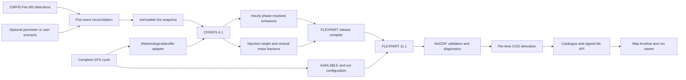

# Fire emissions, plume rise, and FLEXPART integration plan

**Status:** Implemented through the user-visible research workflow; operational enablement remains acceptance-gated  
**Prepared:** 2026-07-22  
**Implemented:** 2026-07-22  
**Primary model path:** CFFEPS 4.1 → FLEXPART 11.1 → NetCDF/COG → existing weather map  
**Initial species:** primary wildfire PM2.5, carbon monoxide (CO), and black carbon (BC)

> The implementation and validation record is maintained in
> [`smoke-pipeline-implementation-report.md`](smoke-pipeline-implementation-report.md).
> `SIMULATION_WRITES_ENABLED` and `SMOKE_OPERATIONAL_ENABLED` intentionally
> remain false until the Phase 6 external scientific acceptance work is signed off.

## 1. Executive summary

The recommended production design adds the Canadian Forest Fire Emissions
Prediction System (CFFEPS) between the existing CWFIS hotspot collection and
FLEXPART. CFFEPS is the best fit because the application already retains the
Canadian Fire Behaviour Prediction inputs it expects: fuel type, estimated
area, rate of spread, head-fire intensity, and surface, below-ground, and total
fuel consumption. CFFEPS 4.1 is available under LGPL-2.1-or-later and produces
hourly emissions, plume injection estimates, and vertical smoke distributions.

The completed pipeline will:

1. reconcile individual satellite detections into reproducible fire-event
   snapshots without counting the same fire repeatedly;
2. use CFFEPS 4.1 to estimate hourly, phase-resolved emissions and plume rise;
3. translate CFFEPS output into mass-conserving FLEXPART releases for PM2.5,
   CO, and BC;
4. run the existing optimized FLEXPART 11.1 build against the archived NOAA GFS
   meteorology;
5. convert FLEXPART NetCDF fields into one Cloud-Optimized GeoTIFF per display
   field and valid time;
6. publish those COGs through the existing PostgreSQL catalogue, signed tile
   service, cross-run timeline, and MapLibre animation; and
7. expose a bounded run builder so a user can select fires, edit defensible
   assumptions, submit a run, monitor it, and view its immutable results.

The first production release should use CFFEPS as both the emissions and plume
model. CAMS GFAS should be ingested only as an independent comparison data set.
A second plume-rise scheme, initially the Moisseeva–Stull energy-balance
parameterization, should be added after the CFFEPS path passes scientific and
operational acceptance. WRF-SFIRE/WRF-Chem is explicitly outside the initial
scope because its coupled fire–atmosphere simulation is too expensive for the
interactive workflow targeted here.

## 2. Decisions made by this plan

| Decision | Selected approach | Reason |
|---|---|---|
| Production emissions model | CFFEPS 4.1 | Native fit to CWFIS/CFFDRS fields, operational Canadian heritage, open source |
| Production plume model | CFFEPS thermodynamic plume rise | Available in the same model and produces a vertical distribution rather than an unrelated fixed height |
| Transport model | Existing optimized FLEXPART 11.1 meter-coordinate build | Already compiled, tested, benchmarked, and capable of GFS input and NetCDF output |
| Meteorology | Existing NOAA GFS 1° archive, 0–24 h at three-hour intervals | Already collected four times daily and validated for FLEXPART |
| Emission cadence | Hourly emissions; meteorology interpolated by the model between three-hour fields | Preserves a useful fire diurnal cycle without tripling the GFS archive in the first release |
| Operational forecast cadence | Four times daily after each complete GFS cycle | Matches the available meteorological analyses; daily execution would produce stale winds |
| Interactive jobs | Database-backed bounded queue claimed by an Airflow worker DAG | Keeps process execution away from the public API and follows existing idempotent orchestration conventions |
| Scientific output | Primary wildfire PM2.5, CO, BC, wet deposition, and dry deposition | Clearly distinguishes direct fire emissions from chemically produced secondary PM2.5 |
| Display format | Existing per-time/per-field COG catalogue | Reuses signed tiles, caching, sampling, timelines, and animation |
| Reproducibility | Immutable scenario revision and complete input/output manifest per run | A result must remain repeatable after data, defaults, or model builds change |
| Initial concurrency | One FLEXPART run at a time in a dedicated Airflow pool | Prevents weather ingestion and the web application from being starved on the single server |

## 3. Current repository baseline

The implementation should extend the current architecture rather than create a
separate smoke application.

### 3.1 Inputs already implemented

- [`python/weather_ingest/cwfis_hotspots.py`](../python/weather_ingest/cwfis_hotspots.py)
  downloads, validates, deduplicates, and normalizes the daily NRCan CWFIS Fire
  M3 product.
- [`airflow/dags/cwfis_hotspot_ingestion.py`](../airflow/dags/cwfis_hotspot_ingestion.py)
  runs at 07:15 UTC, retains raw CSV files, and publishes dated and `latest`
  GeoJSON snapshots.
- Normalized detections retain `fuel`, `fwi`, `ros`, `sfc`, `bfc`, `tfc`,
  `hfi`, `estarea`, sensor, source, coordinates, and observation time.
- [`python/weather_ingest/noaa_gfs.py`](../python/weather_ingest/noaa_gfs.py)
  archives complete GFS pressure-grid GRIB2 cycles and atomically publishes a
  manifest only after every expected forecast file passes validation.
- [`airflow/dags/noaa_gfs_ingestion.py`](../airflow/dags/noaa_gfs_ingestion.py)
  collects the 00Z, 06Z, 12Z, and 18Z cycles. The default horizon is 24 hours
  at three-hour intervals.

### 3.2 Transport baseline already implemented

- FLEXPART 11.1 source and documentation are under [`flexpart/`](../flexpart/).
- The local build supports NCEP GFS input, OpenMP, forward releases, aerosols,
  gases, convection, wet and dry deposition, settling, chemistry options,
  nested output, and NetCDF output.
- The 22-case scientific regression suite in
  [`flexpart/tests/regression_suite/`](../flexpart/tests/regression_suite/)
  covers all major transport options and preserves exact or invariant-based
  reference results.
- The current optimized executable reduced the full regression-suite time by
  33% and the million-particle benchmark by 28.9–49.8%, depending on thread
  count. These results are recorded in
  [`OPTIMIZATION_REPORT.md`](../flexpart/tests/regression_suite/OPTIMIZATION_REPORT.md).
- Existing species definitions include CO and BC. A reviewed PM2.5 definition
  still needs to be added; the generic `SPECIES_AEROSOL` defaults are not a
  scientifically adequate substitute without review.

### 3.3 Publication baseline already implemented

- Handwritten SQL migrations define catalogue runs, valid times, fields, and
  immutable raster assets.
- FastAPI resolves registered assets into signed layer tokens; the tile service
  cannot render arbitrary local paths.
- The frontend already selects variables and products, animates a cross-run
  timeline, preloads future raster frames, cross-fades layers, displays UTC
  timestamps, and samples map values.
- CWFIS hotspots are currently a special GeoJSON selection in
  [`frontend/src/App.tsx`](../frontend/src/App.tsx). Smoke output should be a
  normal catalogue product so it inherits the existing raster workflow.

## 4. Scope

### 4.1 Goals

- Produce reproducible, hourly fire-emission estimates from CWFIS detections or
  user-defined fire scenarios.
- Produce mass-conserving vertical release profiles for FLEXPART.
- Transport PM2.5, CO, and BC for the next 24 hours using the latest complete
  GFS cycle.
- Make operational and interactive smoke runs visible in the current map.
- Preserve every scientific input, executable/configuration version,
  intermediate emission file, and published output checksum.
- Provide uncertainty modes and comparison diagnostics rather than presenting
  one deterministic result as ground truth.
- Keep scheduled weather collection reliable while smoke simulations run.

### 4.2 Non-goals for the first release

- Full atmospheric chemistry or secondary organic aerosol production.
- Prediction of ozone or chemically aged total ambient PM2.5.
- Two-way fire–atmosphere coupling or pyrocumulonimbus simulation.
- Fire suppression, evacuation, or public-health decision support.
- Automatic assimilation of surface air-quality observations.
- Sub-kilometre fire-spread simulation.
- Historical global emissions reconstruction.
- Multi-host or GPU execution.

The PM2.5 product must therefore be labelled **Primary wildfire PM2.5**, not
simply **PM2.5**. FLEXPART will transport and remove the emitted aerosol but it
will not reproduce the full chemical evolution performed by GEM-MACH,
WRF-Chem, or another chemical transport model.

## 5. Scientific data flow



For species \(s\), fire \(f\), combustion phase \(p\), and hour \(t\), the
emissions adapter must preserve the following audited relationship:

```text
emitted_mass[s,f,p,t]
    = incremental_area_burned[f,t]
    × fuel_consumption[f,p,t]
    × emission_factor[s,fuel_type,p]
```

The FLEXPART release compiler then applies normalized vertical fractions:

```text
sum(vertical_fraction[f,t,layer]) = 1

sum(released_mass[s,f,t,layer]) = emitted_mass[s,f,t]
```

Those two mass-conservation equations are hard acceptance criteria, not merely
diagnostic metrics.

## 6. Fire detection and event model

### 6.1 Why an event layer is required

A CWFIS row is a thermal anomaly, not a unique wildfire, perimeter, or measured
hourly burned area. The same fire can generate multiple detections in one
overpass and on consecutive days. Treating every row's `estarea` as new burned
area would overstate fuel consumption and emissions.

The first new processing stage must therefore create an immutable fire-event
snapshot from one or more detections. It must never silently merge, split, or
discard detections without recording the rule and source IDs.

### 6.2 Event-reconciliation algorithm

Implement a deterministic configurable matcher with these steps:

1. Read only validated dated CWFIS artifacts, never the mutable `latest` alias.
2. Use the existing `detection_id` as the immutable observation identity.
3. Match a new detection to a recent event when all configured conditions pass:
   temporal gap, spatial distance, compatible fuel class, and a plausible
   displacement envelope based on elapsed time and rate of spread.
4. Use a stable union-find or connected-component pass so result identity is
   independent of input row order.
5. Derive `event_id` from the sorted member detection IDs and algorithm version,
   not from a database sequence.
6. Preserve ambiguous matches as explicit warnings. Do not choose nondeterministically.
7. Permit a supplied incident identifier or observed perimeter to override the
   automatic grouping while preserving the original detections.
8. Write an event snapshot manifest containing thresholds, algorithm version,
   member detections, excluded detections, warnings, and hashes.

Initial threshold values must live in configuration and must be labelled
provisional until evaluated against known Canadian fire perimeters. They must
not be embedded as undocumented constants in Python.

### 6.3 Area and growth modes

Every scenario revision selects one of the following explicit area modes:

- `cffeps_native_growth`: use CFFEPS fire-growth logic from the detection,
  fire-behaviour values, and forecast weather;
- `observed_perimeter`: derive area increments from versioned perimeter
  observations;
- `user_area_curve`: use an hourly user-specified total or incremental area;
- `fixed_source_test`: constant controlled release used only for validation.

The MVP should use `cffeps_native_growth` for operational runs and
`user_area_curve` for controlled tests. It must not infer an hourly growth curve
by differencing unrelated `estarea` values.

### 6.4 Proposed implementation files

```text
python/weather_ingest/fire_events.py
python/weather_ingest/fire_scenarios.py
airflow/dags/fire_event_reconciliation.py
config/smoke/event_matching.yaml
tests/ingestion/test_fire_events.py
tests/fixtures/fire_events/
```

## 7. CFFEPS 4.1 integration

### 7.1 Source and build layout

Add CFFEPS as a separately traceable upstream component, not copied into the
weather ingestion package:

```text
cffeps/
  README.md
  LICENSE
  upstream/
  docs/
  containers/Dockerfile
  patches/
  tests/
```

Implementation requirements:

- Download the tagged CFFEPS 4.1 release from the official GitHub/Zenodo
  record and record URL, DOI, release checksum, and license.
- Preserve the untouched upstream archive alongside the extracted source.
- Apply local changes only as small documented patches under `cffeps/patches/`.
- Produce a pinned container image that compiles and runs CFFEPS without host
  compiler dependencies.
- Record compiler, libraries, source hash, patch hashes, executable hash, and
  container image digest in every simulation manifest.
- Add a minimal upstream example smoke test before writing the application
  adapter.

### 7.2 Adapter contract

Create [`python/weather_ingest/cffeps.py`](../python/weather_ingest/) with a
strict typed boundary. The adapter must accept a frozen fire snapshot plus a
frozen meteorological manifest and produce a normalized, model-independent
emission bundle.

The normalized bundle should contain, at minimum:

```text
run_id
event_id
source_time_start / source_time_end
latitude / longitude
fuel_type
combustion_phase: flaming | smoldering | residual
incremental_area_m2
fuel_consumption_kg_m2
species
emitted_mass_kg
emission_rate_kg_s
plume_bottom_m_agl
plume_top_m_agl
vertical_layer_bottom_m_agl
vertical_layer_top_m_agl
vertical_fraction
quality_flags
```

Use NetCDF or Parquet for the row-oriented scientific bundle and JSON for its
small manifest. Do not pass the full bundle through Airflow XCom.

### 7.3 Meteorological profile adapter

CFFEPS and the plume calculation need meteorology at each fire location. Build
an adapter that:

- resolves one complete GFS cycle manifest;
- rejects mixed or incomplete cycles;
- samples surface and pressure-level temperature, humidity, wind, pressure,
  and other required CFFEPS fields at each fire;
- interpolates the three-hour GFS sequence to hourly CFFEPS timestamps using a
  documented variable-appropriate rule;
- preserves the original sampled values and the interpolated series;
- handles longitude wrapping and surface elevation consistently; and
- fails the run if a required variable is missing instead of substituting an
  undocumented default.

Hourly GFS ingestion may be evaluated later. It should be enabled only if a
sensitivity experiment shows a material improvement over interpolation that
justifies increasing the current GFS storage rate from roughly 1.5–1.8 GB/day
to approximately three times that amount.

## 8. Emission factors and species

### 8.1 Versioned emission-factor registry

Add a human-reviewable registry:

```text
config/smoke/emission_factors.yaml
config/smoke/fuel_crosswalk.yaml
config/smoke/species.yaml
```

Each factor record must include:

- species;
- source fuel category and mapped Canadian FBP fuel types;
- flaming, smoldering, and residual values where supported;
- units, expected range, citation, table/section, publication year, and DOI;
- uncertainty representation or low/central/high values;
- registry version and effective date; and
- a documented fallback rule for an unmapped fuel type.

The central factor set should begin with the current CFFEPS/FireWork factors
where available and reviewed Urbanski or Andreae factors for BC and other
missing cases. An unmapped fuel must generate a quality warning visible in the
run summary. It must never silently become zero.

### 8.2 Species behavior in FLEXPART

- **CO:** use the existing `SPECIES_CO` definition as the starting point.
  Decide explicitly whether OH loss is enabled for a 24-hour run and record the
  OH-field version when it is.
- **BC:** use the existing `SPECIES_BC` definition after reviewing its assumed
  20 nm median diameter, density, scavenging efficiencies, and lognormal width
  against the intended fresh-smoke application.
- **Primary PM2.5:** create a dedicated `SPECIES_PM25_FIRE` definition. Its
  density, aerodynamic size distribution, hygroscopic/scavenging behavior, and
  dry-deposition parameters require a cited scientific review. Do not rename
  or reuse the generic arbitrary `SPECIES_AEROSOL` file.

Keep emissions mass and aerosol transport properties separate: an emission
factor determines how much BC or PM2.5 is released, while the FLEXPART species
file determines how that released mass settles and is scavenged.

### 8.3 Uncertainty modes

The first UI-visible uncertainty control should offer:

- `central`: central emission factors and CFFEPS plume profile;
- `low`: lower emission factors and conservative injection;
- `high`: upper emission factors and stronger injection; and
- `ensemble`: all three members, subject to a stricter compute limit.

The low/high definitions must be sourced from configured uncertainties. They
must not be arbitrary percentage sliders. Advanced free-form overrides can be
added later for trusted research users.

## 9. Vertical injection profile

### 9.1 Profile rules

The release compiler must use the detailed CFFEPS vertical distribution when
the selected output mode provides it. If a CFFEPS execution provides only a
bottom, representative injection height, and top, the compiler may derive a
profile only through a named, versioned fallback algorithm.

The default profile representation should contain 10–20 adaptive layers:

- finer layers within the planetary boundary layer and near the plume maximum;
- coarser layers aloft;
- an explicit near-surface component when the selected phase/profile model
  calls for it; and
- no mass above the diagnosed plume top.

All heights must carry an explicit datum: metres above ground level for the
emission model, converted to the exact FLEXPART release-height convention only
in the release compiler. Terrain elevation and the conversion result must be
recorded.

### 9.2 Plume-model ensemble path

After CFFEPS acceptance, add the Moisseeva–Stull energy-balance parameterization
as a second independently tested plume implementation. A later Freitas 1-D
implementation is useful for higher-complexity comparisons but should not
block the first release.

The interface should therefore be model-neutral from the beginning:

```python
class PlumeRiseModel(Protocol):
    def calculate(self, fire: FireHour, profile: AtmosphericProfile) -> PlumeProfile: ...
```

Do not put CFFEPS-specific field names directly into the FLEXPART release
compiler.

## 10. FLEXPART release compilation and execution

### 10.1 Generated run directory

Each run receives a short filesystem identifier because the existing
regression work found that long FLEXPART pathname entries can be truncated.

```text
temporary/smoke/<short_run_id>/
  input/
    fire_snapshot.json
    gfs_manifest.json
    emissions.nc
  options/
    COMMAND
    OUTGRID
    RELEASES
    AGECLASSES
    PARTOPTIONS
    SPECIES/
  met/
    AVAILABLE
  output/
  pathnames
  run.log
  manifest.partial.json
```

On success, immutable inputs, logs, normalized emissions, NetCDF output, and
the final manifest move atomically below `derived/smoke/runs/<run_id>/`.
Display COGs move below `processed/local/flexpart_smoke/...`. A failed work
directory moves below `quarantine/smoke/<run_id>/` with its error manifest.

### 10.2 Required generated files

The runner must generate and validate rather than edit shared files:

- `AVAILABLE` from the pinned GFS cycle;
- `COMMAND` for a forward, meter-coordinate, NetCDF run;
- `OUTGRID` from the requested bounded domain and resolution;
- `RELEASES` containing the hourly, species-specific, vertically stratified
  source terms;
- reviewed copies of the three species definitions;
- `AGECLASSES` and `PARTOPTIONS`; and
- a run-local `pathnames` file using short relative paths.

The generator must independently parse its own output before executing
FLEXPART. It must verify dates, coordinates, height order, species mapping,
particle counts, total release mass, and the availability of every required
meteorological time.

### 10.3 Source aggregation and particle allocation

An unbounded release for every detection, phase, species, hour, and vertical
layer will become computationally impractical. The compiler should:

1. work from reconciled fire events, not raw detection rows;
2. aggregate compatible sources into configurable spatial cells only when the
   chosen grid cannot resolve their separation;
3. preserve separate high-intensity or high-injection events;
4. allocate particles proportional to mass while enforcing a configured
   minimum per non-zero release;
5. impose a total particle budget and report any aggregation; and
6. refuse a run whose requested detail cannot fit the budget instead of
   silently dropping sources or layers.

The manifest must record pre-aggregation and post-aggregation fire counts,
release count, particle count, and mass by species.

### 10.4 Runtime isolation

- Add a dedicated Airflow pool `flexpart_runs` with one slot initially.
- Set `OMP_NUM_THREADS` from a bounded configuration, defaulting to the
  empirically useful local value rather than every host core.
- Set `OMP_PLACES=cores`, `OMP_PROC_BIND=true`, and unlimited stack size as
  required by the FLEXPART manual.
- Execute through an argument array, never a shell assembled from user input.
- Apply wall-time, memory, output-size, particle-count, release-count, domain,
  horizon, and concurrent-run limits.
- Capture the exit code and complete stdout/stderr. FLEXPART 11.1 returns zero
  only for a successful run, but a zero exit must still be followed by output
  validation.

### 10.5 Proposed implementation files

```text
python/weather_ingest/flexpart_config.py
python/weather_ingest/flexpart_releases.py
python/weather_ingest/flexpart_runner.py
python/weather_ingest/smoke_outputs.py
config/smoke/flexpart.yaml
flexpart/options/SPECIES/SPECIES_PM25_FIRE
tests/ingestion/test_flexpart_config.py
tests/ingestion/test_flexpart_releases.py
tests/ingestion/test_smoke_outputs.py
```

## 11. Output processing and catalogue publication

### 11.1 Scientific artifacts

Retain the original FLEXPART NetCDF output as the authoritative multidimensional
artifact. Validate:

- expected coordinate dimensions and monotonicity;
- expected time range and cadence;
- species names and units;
- finite values and valid missing-value masks;
- non-negative concentrations and deposition;
- release and output mass summaries;
- geographic bounds; and
- presence of all requested output times.

Generate a compact machine-readable summary containing total released mass,
remaining airborne mass, wet deposition, dry deposition, domain outflow where
available, maxima, percentiles, and non-zero cell counts by time and species.

### 11.2 Display products

Derive one COG for each requested valid time and display field:

| Field code | Display name | Initial canonical unit |
|---|---|---|
| `wildfire_pm25_surface` | Primary wildfire PM2.5 at surface | µg m⁻³ |
| `wildfire_co_surface` | Wildfire CO at surface | µg m⁻³ or reviewed ppbv conversion |
| `wildfire_bc_surface` | Wildfire black carbon at surface | µg m⁻³ |
| `wildfire_pm25_column` | Primary wildfire PM2.5 column burden | mg m⁻² |
| `wildfire_pm25_wet_deposition` | PM2.5 wet deposition | mg m⁻² |
| `wildfire_pm25_dry_deposition` | PM2.5 dry deposition | mg m⁻² |
| `wildfire_injection_height` | Emission-weighted injection height | m AGL |

The final CO display unit must be chosen only after inspecting FLEXPART output
semantics and defining the molecular conversion inputs. The plan deliberately
does not hard-code a conversion before that review.

The surface product must document which FLEXPART output layer or vertical
average it represents. It must not be labelled as a regulatory monitor-equivalent
surface concentration without validation.

### 11.3 Catalogue mapping

Register the output as a normal forecast product, for example:

```text
provider: local_flexpart
product: flexpart_wildfire_smoke
domain: scenario domain or named operational domain
run_time: pinned GFS initialization time
valid_time: FLEXPART output time
```

Multiple scenario runs may use the same GFS initialization time, so the current
catalogue identity `(product, domain, run_time)` is insufficient for arbitrary
interactive scenarios. Use one of these designs after a migration proof:

1. preferred: add a nullable `simulation_run_id` discriminator to catalogue
   run identity and expose scenario filtering in the API; or
2. create a separate per-scenario catalogue product, which is simpler but will
   pollute product selection and scale poorly.

The preferred first-class `simulation_run_id` design should be implemented.
Operational runs use a stable scenario identity named `operational_latest`.

## 12. Database design

Add a `simulation` schema through new numbered, checksum-verified handwritten
SQL migrations. Never edit an applied migration and do not introduce an ORM.

### 12.1 Core tables

**`simulation.model_build`**

```text
id, model_name, model_version, source_sha256, patch_set_sha256,
executable_sha256, container_digest, toolchain, created_at, enabled
```

**`simulation.scenario`**

```text
id UUID, name, description, owner_label, created_at, updated_at, archived_at
```

**`simulation.scenario_revision`**

```text
id UUID, scenario_id, revision_number, canonical_config JSONB,
config_sha256, created_at, unique(scenario_id, revision_number),
unique(scenario_id, config_sha256)
```

Revisions are immutable. Editing a scenario creates a revision rather than
changing the inputs of an old result.

**`simulation.run`**

```text
id UUID, scenario_revision_id, run_kind, status, requested_at, queued_at,
started_at, completed_at, requested_by, gfs_cycle_time, cffeps_build_id,
flexpart_build_id, random_seed_policy, input_manifest_path,
output_manifest_path, product_run_id, metrics JSONB, warnings JSONB,
error_class, error_message, run_key, cancellation_requested_at
```

`run_key` is a unique hash of the scenario revision, exact input checksums,
model builds, and material configuration. Re-submitting an identical completed
run returns the existing result unless the request explicitly asks for a
stochastic replicate.

**`simulation.run_input`**

```text
run_id, input_kind, relative_path, sha256, size_bytes, metadata JSONB
```

**`simulation.run_artifact`**

```text
run_id, artifact_kind, relative_path, sha256, size_bytes, mime_type,
metadata JSONB, status
```

Do not place every hourly fire/species/layer row in PostgreSQL. Store the
scientific array/table as a checksummed artifact and retain only searchable
summaries in the database.

### 12.2 State machine

```text
draft scenario
  -> queued
  -> resolving_inputs
  -> emissions_running
  -> transport_running
  -> processing_outputs
  -> publishing
  -> complete | complete_with_warnings

Any active state -> failed
queued or active -> cancellation_requested -> cancelled
```

State transitions must be atomic and compare the expected previous state so
two Airflow workers cannot claim the same job.

### 12.3 Permissions

- `weather_api`: read simulation state; insert bounded scenarios/revisions/runs
  only when simulation writes are enabled.
- `weather_ingest`: claim and update runs; register inputs, artifacts, and
  catalogue outputs.
- `weather_tiles`: no simulation write access.
- `weather_readonly` and `weather_backup`: read all simulation metadata.

Because the current application has no user authentication, write endpoints
must default to disabled outside a trusted local deployment. Public exposure
requires authentication, ownership/authorization checks, quotas, and audit
logging before simulation submission is enabled.

### 12.4 Expected migrations

```text
database/migrations/0019_create_simulation_schema.sql
database/migrations/0020_register_flexpart_smoke_product.sql
database/migrations/0021_link_catalogue_and_simulation_runs.sql
database/queries/simulation/*.sql
```

Migration numbers must be adjusted if other migrations land first.

## 13. Airflow workflows

### 13.1 `fire_event_reconcile`

Schedule shortly after the daily CWFIS DAG and permit manual backfill.

```text
resolve dated hotspot manifests
  -> validate source hashes
  -> reconcile events
  -> validate event snapshot
  -> publish immutable snapshot and latest pointer
```

### 13.2 `flexpart_smoke_operational`

Schedule after each expected GFS completion window: four times daily. Use the
latest valid fire-event snapshot available at the forecast cutoff. Record its
age and emit a prominent warning when it exceeds the configured freshness
threshold.

```text
select complete GFS cycle and fire snapshot
  -> create/reuse operational run
  -> prepare CFFEPS meteorology
  -> run and validate CFFEPS
  -> compile and validate FLEXPART inputs
  -> run FLEXPART
  -> validate NetCDF and mass diagnostics
  -> derive COGs
  -> register all assets atomically
  -> mark visible and finalize
```

No catalogue run becomes visible until every configured core field passes its
quality gates. A partial result remains inspectable by operators but cannot
appear in the public timeline.

### 13.3 `flexpart_smoke_worker`

Run every few minutes with `max_active_runs=1`. Atomically claim one queued
interactive job ordered by priority and request time, then execute the same
task-group used by the operational DAG. The two DAGs share the one-slot
`flexpart_runs` pool.

### 13.4 Retry behavior

- Input discovery and provider reads: retry with bounded exponential backoff.
- CFFEPS/FLEXPART deterministic execution failure: one automatic retry only
  after cleaning the run-local output directory; retain both logs.
- Scientific validation failure: do not retry unchanged inputs automatically.
- COG transformation or catalogue registration: safe idempotent retry.
- Cancellation: stop before the next phase; active process termination must
  record the signal, exit state, and retained artifacts.

Airflow XCom values remain limited to run IDs, database IDs, relative paths,
checksums, counts, and small summaries.

## 14. API plan

Add Pydantic schemas and repository methods using the existing dependency and
handwritten-SQL pattern.

### 14.1 Read endpoints

```text
GET /api/v1/fire-events?start=&end=&bbox=
GET /api/v1/fire-events/{event_id}
GET /api/v1/smoke/scenarios
GET /api/v1/smoke/scenarios/{scenario_id}
GET /api/v1/smoke/scenarios/{scenario_id}/revisions
GET /api/v1/smoke/runs/{run_id}
GET /api/v1/smoke/runs/{run_id}/artifacts
GET /api/v1/smoke/runs/{run_id}/summary
```

### 14.2 Write endpoints

```text
POST /api/v1/smoke/scenarios
POST /api/v1/smoke/scenarios/{scenario_id}/revisions
POST /api/v1/smoke/scenarios/{scenario_id}/runs
POST /api/v1/smoke/runs/{run_id}/cancel
```

Submitting a run returns `202 Accepted` with its run ID, status URL, whether an
identical result was reused, and a conservative compute/storage estimate.

### 14.3 Request bounds

Validate all limits before inserting a queued job:

- start/end must fall within the selected GFS cycle and maximum horizon;
- bbox must be ordered, finite, and below the maximum area;
- grid spacing must come from an enumerated set;
- species, plume model, uncertainty mode, and output fields are enumerations;
- referenced fire IDs must exist in the frozen snapshot;
- custom area curves must be finite, non-negative, ordered, and bounded;
- total estimated releases and particles must remain below configured limits;
- no request field may contain a filesystem path, executable, shell text, or
  arbitrary environment variable; and
- API responses must not disclose absolute host paths.

### 14.4 Planned files

```text
python/weather_api/simulation_schemas.py
python/weather_api/simulation_repository.py
database/queries/simulation/
tests/test_simulation_api.py
tests/test_simulation_sql_contract.py
```

## 15. Frontend plan

### 15.1 Run builder

Add a **Build smoke run** action available when wildfire hotspots or an
existing smoke product is selected. The builder should guide the user through:

1. **Domain and time:** current map extent or a bounded drawn rectangle, latest
   complete GFS cycle, and up to 24 hours.
2. **Fire sources:** all events in view, selected events, one user-drawn source,
   or a saved scenario revision.
3. **Fire assumptions:** CFFEPS native growth or a reviewed custom area curve;
   fuel/consumption values are visible and overrides are clearly marked.
4. **Species:** primary PM2.5, CO, and/or BC.
5. **Plume and uncertainty:** CFFEPS plume rise and central/low/high/ensemble.
6. **Resolution and compute:** enumerated output grid and particle budget.
7. **Review:** estimated release count, particle count, storage, input ages,
   assumptions, and warnings before submission.

Advanced scientific settings should be collapsed by default. The normal user
must not have to understand FLEXPART namelists.

### 15.2 Job progress

Show the persisted state from the API, not an optimistic browser-only state:

```text
Queued → Resolving inputs → Estimating emissions → Transporting smoke
       → Preparing map layers → Complete
```

Display warnings, runtime, GFS cycle, fire snapshot time, model versions,
species, and a cancellation control. Poll slowly while queued and more quickly
during an active phase; stop polling on a terminal state.

### 15.3 Result visualization

Completed smoke outputs should appear through the ordinary variable/product
selector. Reuse the existing date range, **Now**, timestamp overlay, buffering,
animation, opacity cutoff, legends, and point-sampling code.

Add a compact run-information panel containing:

- scenario and run ID;
- initialization and valid time;
- selected species/diagnostic;
- model and emission-factor versions;
- total released mass;
- fire count and any aggregation;
- plume-model and uncertainty member; and
- a clear **primary emissions only** caveat.

The original hotspot layer should remain available as an overlay or source
context while a smoke raster is selected. It should not become a permanently
visible separate widget.

### 15.4 Planned files

```text
frontend/src/smokeApi.ts
frontend/src/SmokeRunBuilder.tsx
frontend/src/SmokeRunStatus.tsx
frontend/src/SmokeRunDetails.tsx
frontend/src/smokeSchemas.ts
frontend/src/smokeApi.test.ts
frontend/src/SmokeRunBuilder.test.tsx
```

Prefer extracting these components instead of expanding `App.tsx` with another
large special case.

## 16. Configuration and storage policy

### 16.1 Configuration

Add bounded settings to `.env.example`, including:

```text
SIMULATION_WRITES_ENABLED=false
SMOKE_OPERATIONAL_ENABLED=false
SMOKE_MAX_HORIZON_HOURS=24
SMOKE_MAX_DOMAIN_CELLS=<reviewed value>
SMOKE_MAX_PARTICLES=<reviewed value>
SMOKE_MAX_RELEASES=<reviewed value>
SMOKE_MAX_QUEUED_RUNS=<reviewed value>
SMOKE_FLEXPART_THREADS=<benchmarked value>
SMOKE_RUN_TIMEOUT_SECONDS=<reviewed value>
SMOKE_MINIMUM_FREE_BYTES=<reviewed value>
SMOKE_INTERACTIVE_RETENTION_DAYS=<reviewed value>
SMOKE_OPERATIONAL_RETENTION_DAYS=<reviewed value>
```

Scientific parameters belong in version-controlled YAML, not environment
variables. Environment variables contain deployment limits and feature flags.

### 16.2 Storage classes

- Raw CWFIS and GFS: unchanged append-only archives.
- Fire-event snapshots: small, long-lived derived inputs.
- Scenario revisions and manifests: long-lived.
- Original CFFEPS bundle and FLEXPART NetCDF: retained for every published run
  during the scientific-validation period.
- Display COGs: retained according to operational/interactive policy.
- Temporary workspaces: removed only after successful atomic publication or
  moved to quarantine on failure.

Extend the existing capacity-admission and dry-run-first retention tooling.
Never allow a retention operation to delete an input still referenced by a
retained simulation manifest.

## 17. Observability and operations

### 17.1 Structured logs

Every log record should carry, when applicable:

```text
simulation_run_id, scenario_revision_id, gfs_cycle,
fire_snapshot_id, cffeps_build, flexpart_build,
species, task_phase, attempt, request_id
```

Do not log complete user request bodies or absolute sensitive paths.

### 17.2 Metrics

Add Prometheus metrics and Grafana panels for:

- queued and active simulation jobs;
- phase duration and total duration;
- success, warning, failure, and cancellation counts;
- fire/event/release/particle counts;
- released mass by species;
- mass-balance residual;
- input age for CWFIS and GFS;
- CFFEPS and FLEXPART exit failures;
- COG count and transformation time;
- per-run input/output/temporary bytes; and
- available disk space versus admission threshold.

### 17.3 Operator commands

Add wrappers that are safe and parameter-bounded:

```text
scripts/trigger_fire_event_reconciliation.sh
scripts/trigger_operational_smoke.sh
scripts/inspect_smoke_run.sh <run-id>
scripts/compare_smoke_run.sh <run-id> <reference-run-id>
```

The inspect command should verify checksums and summarize state without
modifying or rerunning a job.

## 18. Testing and scientific validation

### 18.1 Unit and contract tests

- deterministic fire grouping regardless of input order;
- no duplicated detection membership;
- area-mode validation and unit conversions;
- fuel-type crosswalk coverage;
- emission-factor lookup, citations, uncertainty members, and fallbacks;
- hourly interpolation and pressure-profile extraction;
- vertical fractions finite, non-negative, ordered, and summing to one;
- exact species/fire/hour mass conservation into releases;
- particle allocation and aggregation bounds;
- safe FLEXPART option generation and round-trip parsing;
- state-machine transitions and atomic job claim;
- API authorization flag and input limits;
- output NetCDF validation and COG derivation;
- catalogue uniqueness with multiple scenarios on one GFS cycle; and
- frontend builder validation and terminal-state polling.

### 18.2 CFFEPS golden cases

Create at least ten small cases spanning:

- conifer, deciduous, mixedwood, grass, and slash/other supported fuels;
- low and high fuel consumption;
- low and high head-fire intensity;
- stable and unstable profiles;
- shallow and penetrative plumes; and
- flaming-dominated and smoldering/residual-heavy burns.

Record exact inputs, executable/config hashes, phase/species emissions, plume
profile, warnings, and output checksums. Confirm results against the official
CFFEPS example or published values wherever such a comparison is possible.

### 18.3 FLEXPART integration cases

Retain the existing 22-case suite unchanged. Add smoke-specific cases that
exercise:

- PM2.5 aerosol wet and dry deposition;
- BC aerosol settling and scavenging;
- CO gas transport, with and without OH loss if both modes are supported;
- multiple fires, hours, species, and vertical layers;
- restart behavior for a production-shaped run;
- missing GFS file rejection;
- mass conservation from emission bundle to generated `RELEASES`; and
- deterministic single-thread reproducibility plus invariant-based
  multi-thread comparison.

No future optimization may be accepted unless the existing 22 cases and the
new smoke suite pass the same exact/invariant policy documented in the current
regression suite.

### 18.4 External evaluation

Use three levels of validation:

1. **Inventory comparison:** compare total PM2.5, CO, BC, and injection heights
   with CAMS GFAS over the same fire/day. Expect differences, but investigate
   order-of-magnitude or sign/unit errors.
2. **Vertical validation:** compare diagnosed plume heights with available
   satellite plume-height retrievals or published Canadian validation cases.
3. **Surface evaluation:** compare transported PM2.5 timing and magnitude with
   NAPS, AirNow, or another quality-controlled monitor network. Treat this as
   evaluation, not assimilation, in the first release.

Evaluate at least one weak event, one moderate event, and one major Canadian
wildfire episode. Document observation availability, model/observation
representativeness, bias, error, correlation, false alarms, missed events, and
the sensitivity to emissions versus injection height.

### 18.5 Acceptance tolerances

Numeric tolerances must be defined per test before inspecting candidate output.
At minimum:

- release mass error: machine-rounding scale after unit conversion;
- vertical fraction sum: absolute error no greater than a configured tight
  tolerance such as `1e-10` before file formatting;
- no NaN, infinity, or unexplained negative concentration/deposition;
- exact single-thread results for fixed-input golden cases where the model is
  deterministic;
- invariant and distribution-level comparison for known OpenMP stochastic
  cases; and
- zero missing requested display frames in a published catalogue run.

## 19. Security and failure containment

- The API never accepts executable names, shell commands, paths, arbitrary
  namelist keys, container images, or URLs.
- The worker runs as a non-root user with write access only to the weather-data
  working and output directories it needs.
- CFFEPS and FLEXPART inputs are generated from validated schemas and read back
  before execution.
- A simulation cannot access PostgreSQL migration credentials.
- Published artifacts use the existing registered-path and signed-token tile
  boundary.
- Feature flags keep write endpoints and operational scheduling disabled until
  acceptance checks pass.
- Quotas and one-slot execution protect weather ingestion and API latency.
- Partial COG publication cannot expose an incomplete run.
- A failed model run never updates the stable latest-smoke pointer.
- Model disclaimers and input ages are visible in both API metadata and the UI.

## 20. Phased implementation plan

### Phase 0 — Reproducible CFFEPS foundation

**Implementation**

- Add the CFFEPS 4.1 source archive, license, source documentation, checksum,
  container build, and local README.
- Compile CFFEPS in the container and execute an official/minimal example.
- Record a model-build manifest and add CI/local smoke tests.
- Review exact CFFEPS input/output formats and identify the v4.1 fields needed
  for PM2.5, CO, BC, plume height, and vertical distribution.

**Acceptance**

- A clean container build succeeds on AMD64 and ARM64 or documents a tested
  architecture-specific build path.
- A fixed test case is repeatable and its output checksum/parsed values are
  recorded.
- License, upstream version, patches, compiler, and executable hashes are
  unambiguous.

### Phase 1 — Fire events and frozen input manifests

**Implementation**

- Implement event reconciliation and event snapshots.
- Add area modes, scenario schemas, canonical JSON hashing, and fire selection.
- Extract CFFEPS meteorological profiles from the existing GFS archive.
- Add fixtures covering repeated and ambiguous detections.

**Acceptance**

- Reprocessing the same dated CWFIS files produces byte-identical event IDs and
  normalized snapshot content apart from explicitly volatile metadata.
- No detection belongs to two events in one snapshot.
- Every model input can be traced to a source file and checksum.

### Phase 2 — CFFEPS emissions and plume bundle

**Implementation**

- Implement the CFFEPS adapter and normalized emission bundle.
- Add the fuel crosswalk and versioned emission-factor registry.
- Add BC as a configured species.
- Create and compare at least ten CFFEPS golden cases.
- Add emission and plume quality flags and summary reports.

**Acceptance**

- Emission equations and units pass independent recalculation tests.
- Phase totals equal species/fire/hour totals.
- Vertical fractions are valid and mass conserving.
- Unknown fuels are rejected or explicitly warned according to configuration.

### Phase 3 — FLEXPART production runner

**Implementation**

- Implement release aggregation, particle allocation, and run-local option
  generation.
- Add the reviewed PM2.5 species file.
- Generate GFS `AVAILABLE`, execute FLEXPART, and validate NetCDF output.
- Add smoke-specific regression cases while retaining the existing 22 cases.
- Benchmark representative 24-hour, three-species workloads to select default
  threads, particles, grid size, and timeout.

**Acceptance**

- Emission-bundle mass equals FLEXPART release mass by species.
- A complete 24-hour run succeeds with convection, wet/dry deposition, and
  settling enabled where applicable.
- Existing 22-case regressions and new smoke cases pass.
- Resource bounds are based on recorded benchmark results.

### Phase 4 — Database, DAGs, and publication

**Implementation**

- Add simulation schema/migrations, queries, permissions, and idempotent job
  state transitions.
- Implement operational and interactive Airflow workflows using a shared task
  group and one-slot pool.
- Derive COGs, register fields/times/assets, and atomically publish runs.
- Extend capacity, retention, integrity, backup, logging, and metrics support.

**Acceptance**

- Re-running every phase creates no duplicate run, time, or asset rows.
- Two workers cannot claim the same job.
- A failure at each task boundary leaves a recoverable, non-visible result.
- A complete run is available through the existing signed tile and sample APIs.

### Phase 5 — API and run-builder UI

**Implementation**

- Add bounded scenario/run APIs behind the disabled-by-default write flag.
- Implement the run builder, review screen, job progress, cancellation, result
  details, and warnings.
- Integrate smoke fields into the current selector and retain hotspots as
  optional context.
- Add frontend and API tests, including stale polling and failure states.

**Acceptance**

- A trusted local user can build, submit, monitor, cancel, reopen, and visualize
  a run without editing files or namelists.
- Invalid or over-budget jobs are rejected before queuing with actionable
  messages.
- All output frames animate through the existing ready-frame buffer without
  hiding an unready frame.
- The map and sample panel display the correct run and valid-time metadata.

### Phase 6 — Evaluation and operational enablement

**Implementation**

- Run documented weak, moderate, and major-fire evaluations.
- Compare emissions/injection with GFAS and surface timing with monitoring data.
- Tune only version-controlled, scientifically justified parameters.
- Complete operator runbooks, backup/restore exercises, capacity tests, and
  failure drills.
- Enable `SMOKE_OPERATIONAL_ENABLED` only after review.

**Acceptance**

- Evaluation results, limitations, and known biases are documented.
- Four daily operational runs complete inside the time available before the
  next GFS cycle on the target server.
- Weather ingestion and map/API latency remain within their existing operating
  envelope during a smoke run.
- Operators can diagnose and recover a failed run without database surgery.

## 21. Suggested delivery order and effort

For one experienced developer working with periodic atmospheric-science review,
a realistic initial estimate is 8–12 weeks:

| Work package | Estimated effort | Main uncertainty |
|---|---:|---|
| CFFEPS build and format audit | 1–2 weeks | v4.1 build portability and output details |
| Fire events, GFS profiles, and frozen manifests | 1–2 weeks | Defensible event matching and area-growth semantics |
| Emissions/plume adapter and golden tests | 1–2 weeks | Fuel/phase mapping and BC factor review |
| FLEXPART release compiler and production run | 1–2 weeks | Particle/release scaling and GFS operational fit |
| Database, DAGs, output processing, and operations | 1–2 weeks | Scenario identity in the catalogue and storage volume |
| API/frontend workflow | 1–2 weeks | Keeping controls understandable while retaining reproducibility |
| Scientific evaluation and operational hardening | 1–3 weeks | Availability of suitable plume and surface observations |

The first useful milestone is a command-line end-to-end case through Phase 3.
The first user-visible milestone is Phase 5. Operational scheduling is the last
step, not the first.

## 22. Major risks and mitigations

| Risk | Consequence | Mitigation |
|---|---|---|
| Repeated hotspots are treated as new burned area | Large emission overestimate | Event reconciliation, explicit area modes, perimeter override, source-level audit |
| `estarea` is interpreted as an observed perimeter | False precision | Label its semantics, retain uncertainty, prefer native growth or observed perimeters |
| BC/PM2.5 factors are applied to the wrong fuel or phase | Species bias | Versioned cited registry, coverage tests, visible fallback warnings |
| One plume-top height is used as the entire source | Incorrect surface/downwind concentrations | Preserve or derive a normalized multi-layer profile with mass tests |
| AGL/ASL height confusion | Systematic injection error | Typed height datum and one audited conversion boundary |
| Three-hour GFS cadence misses rapid plume changes | Timing/height bias | Hourly interpolation in MVP; sensitivity test before expanding ingestion |
| Too many fires × layers × species exhaust resources | Failed or delayed jobs | Resolution-aware aggregation, particle budget, preflight estimate, hard rejection |
| FLEXPART output is mistaken for total observed PM2.5 | Misleading map | Product naming, primary-emissions caveat, chemistry scope in metadata/UI |
| Interactive writes are publicly exposed without auth | Resource abuse | Writes disabled by default; add auth/ownership/quotas before public enablement |
| Partial results appear on the timeline | Missing or inconsistent animation frames | Atomic catalogue visibility only after all core fields pass |
| Model/config updates make old runs irreproducible | Invalid comparison | Immutable revisions, source/config/executable hashes, retained input manifests |
| Smoke jobs starve ingestion | Stale weather data | Dedicated one-slot pool, thread/memory limits, disk admission, benchmarked defaults |

## 23. Definition of done

The project is complete when all of the following are true:

- CFFEPS 4.1 builds reproducibly and its source/license/checksums are archived.
- Fire detections are converted into deterministic, audited event snapshots.
- Hourly PM2.5, CO, and BC emissions and vertical profiles are produced with
  cited, versioned assumptions.
- The emission bundle and generated FLEXPART releases conserve mass.
- A 24-hour three-species FLEXPART run uses one pinned complete GFS cycle and
  passes output validation.
- All existing FLEXPART regression tests plus the new smoke suite pass.
- NetCDF outputs are retained and derived COGs are atomically registered.
- Smoke layers resolve, tile, sample, buffer, and animate through the existing
  application without a parallel serving path.
- A trusted user can create an immutable scenario revision, submit a bounded
  run, inspect progress/warnings/provenance, and reopen the result.
- Failed, cancelled, retried, identical, and over-budget jobs behave predictably.
- GFAS and observation comparisons are documented for representative events.
- Operations documentation covers capacity, retention, backup, failure
  recovery, upgrades, and disabling the scheduler.
- The UI clearly states that the output is a research estimate of primary
  wildfire pollution, not an official air-quality or emergency forecast.

## 24. Primary references

- CFFEPS 4.1 source release and LGPL terms: <https://zenodo.org/records/15305591>
- FireWork v2.0 and CFFEPS mechanics: <https://gmd.copernicus.org/articles/12/3283/2019/>
- Global Forest Fire Emissions Prediction System and CFFEPS context:
  <https://gmd.copernicus.org/articles/17/7713/2024/>
- Current ECCC RAQDPS/FireWork system description:
  <https://gmd.copernicus.org/articles/19/4137/2026/>
- USFS BlueSky framework: <https://research.fs.usda.gov/pnw/products/dataandtools/bluesky-framework>
- BlueSky source: <https://github.com/pnwairfire/bluesky>
- CAMS GFAS emissions and injection-height fields:
  <https://confluence.ecmwf.int/pages/viewpage.action?pageId=129128405>
- Moisseeva–Stull energy-balance plume rise:
  <https://acp.copernicus.org/articles/21/1407/2021/>
- Briggs/Freitas/Sofiev comparison:
  <https://acp.copernicus.org/articles/23/3083/2023/>
- Urbanski wildland-fire emission factors:
  <https://research.fs.usda.gov/treesearch/45727>
- Andreae updated biomass-burning emission factors:
  <https://acp.copernicus.org/articles/19/8523/2019/>
- FLEXPART 11 model paper: <https://gmd.copernicus.org/articles/17/7595/2024/>
