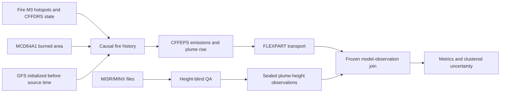

# Building a Performance-Blind, Provenance-Preserving Validation Framework for CFFEPS–FLEXPART Wildfire Smoke Simulation over Canada

**Full research-paper draft**  
**Version:** 2026-07-27  
**Authors:** to be assigned by the research team  
**Corresponding author:** to be assigned  
**Manuscript status:** internal draft; not peer reviewed  
**Scientific status of the system:** not yet accepted  
**Formal expanded-cohort FLEXPART holdout opened:** no

## Abstract

The concentration and transport distance of wildfire smoke depend on both the
mass emitted and its vertical injection. An end-to-end comparison at the
surface cannot by itself validate a smoke model because errors in burned area,
fuel consumption, emission factors, plume rise, transport, and deposition can
compensate. We developed a component-wise, provenance-preserving research
system that links Canadian Forest Fire Danger Rating System state and Fire M3
hotspots, independently observed MODIS MCD64A1 burned area, the Canadian
Forest Fire Emissions Prediction System (CFFEPS) 4.1, and the FLEXible
PARTicle dispersion model (FLEXPART) 11.1. The system produces primary
wildfire PM2.5, carbon monoxide (CO), black carbon (BC), vertical aerosol
profiles, and wet- and dry-deposition fields. Every source, transformation,
executable, configuration, random seed, and output is retained with a
cryptographic identity.

The model chain was first exercised in a March–May 2026 pilot containing five
retained fires and eight event-days. CFFEPS generated 111,273.8 kg PM2.5,
699,609.7 kg CO, and 1,927.8 kg BC released inside the 24 h transport windows.
All 24 species-day FLEXPART members completed and passed structural,
non-negativity, release-mass, and output-integrity checks. The pilot did not
pass scientific acceptance: it lacked major fires, its domain-wide GFAS
inventory comparisons were strongly negatively biased, its TROPOMI
aerosol-height diagnostic failed the frozen RMSE criterion, and its surface
PM2.5 sample was underpowered. A one-thread member also exposed two
non-finite wet-deposition values. We traced that numerical defect upstream to
an undefined zero-skew recovery calculation in FLEXPART's convective boundary
layer particle reinitialization, corrected the limiting case rather than
sanitizing output, and verified the correction in a focused test, 22 compact
regression cases, and 48 complete one- and eight-thread member runs.

For an acceptance-capable vertical evaluation, we then separated MISR/MINX
observation selection from model preparation. An exhaustive query of the
public MISR Plume Height Project through MERLIN for
2017-01-01–2026-07-27 returned processed records for 2017 and 2018. We
downloaded and hash-verified 772 Canadian-interior MINX files representing 388
band-independent plume families in 78 MISR orbits. Height-blind metadata and
geometry screening selected 386 families. A provisional post-selection rule
requiring at least 10 wind-corrected retrievals at or above 250 m above ground
level retained 109 observation candidates. All 109 matched complete Fire M3
fuel and fire-weather state, and 88 also had qualifying independent MCD64A1
area. These 88 candidates span 37 orbits, removing the earlier observation
availability bottleneck.

The expanded inventory is a completed cohort-construction result, not a
completed model-skill result. Physical-fire clustering, external review of the
observation operator, central and reserve cohort freezing, historical
meteorology, strictly causal pre-overpass CFFEPS histories, formal FLEXPART
comparisons, final surface validation, sensitivity experiments, and scheduled
shadow cycles remain incomplete. The framework demonstrates how a smoke model
can be developed and tested without using validation observations to tune the
system being evaluated, while retaining negative results and numerical
failures as part of the scientific record.

**Keywords:** wildfire smoke; CFFEPS; FLEXPART; MISR; MINX; MCD64A1; CFFDRS;
PM2.5; plume rise; Lagrangian particle dispersion; scientific validation;
reproducibility

## Plain-language summary

Wildfire-smoke models must estimate how much smoke a fire emits, how high the
smoke rises, where winds carry it, and how much is removed by rain or contact
with the surface. A model can appear correct for the wrong reasons if errors
in these steps cancel. We therefore built and tested each step separately.

The software can reproducibly convert Canadian fire and weather data into
PM2.5, CO, and black-carbon releases, run FLEXPART, and retain complete input
and output records. A first small experiment revealed scientific weaknesses
and a real numerical defect. The defect was explained and corrected, but the
scientific weaknesses were not hidden. We also expanded the satellite
plume-height population from a narrow 16-orbit sample to 88 strong candidates
across 37 MISR orbits. This is enough to design a statistically meaningful
plume-height experiment, but that final experiment has not yet been run.

## 1. Introduction

Wildfire smoke is a coupled source, meteorological, and transport problem.
The near-source surface concentration of particulate matter depends on burned
area, fuel loading and moisture, combustion phase, emission factors, fire
energy, atmospheric stability, and the altitude of injection. Once released,
smoke is advected by resolved winds, mixed by unresolved turbulence,
redistributed by convection, and removed by gravitational settling and wet
and dry deposition. Material retained in the boundary layer can strongly
affect nearby air quality, whereas material injected into the free troposphere
can travel farther in faster winds and encounter fewer near-surface removal
processes ([Ye et al., 2021](https://doi.org/10.5194/acp-21-14427-2021)).

This structure creates an identifiability problem. Let a downwind
concentration be written schematically as

$$
C = \mathcal{T}\!\left[
    A,\ F,\ EF,\ \phi_z,\ \mathbf{U},\ K,\ D
\right],
$$

where $A$ is burned area, $F$ is fuel consumption per area, $EF$ is a vector
of species emission factors, $\phi_z$ is the vertical release distribution,
$\mathbf{U}$ is the resolved wind, $K$ represents turbulent and convective
mixing, $D$ represents removal, and $\mathcal{T}$ is the atmospheric transport
operator. A single observed value of $C$ does not uniquely determine any
input. An underestimate of emitted mass can be offset by overly shallow
injection, and excessive deposition can be offset by excessive source mass.
Consequently, end-to-end agreement is necessary but not sufficient evidence
that the system's component processes are scientifically credible.

CFFEPS is a process-oriented Canadian fire-emissions and plume-rise model. It
uses the Canadian Fire Weather Index (FWI) and Fire Behaviour Prediction (FBP)
systems to estimate fuel consumption, divides consumption among flaming,
smouldering, and residual phases, applies species emission factors, and
estimates plume penetration using fire-energy and atmospheric-profile
information. The FireWork v2.0 implementation demonstrated that CFFEPS-based
hourly emissions and improved plume injection could improve North American
surface air-quality forecasts relative to an earlier operational
configuration ([Chen et al., 2019](https://doi.org/10.5194/gmd-12-3283-2019)).

FLEXPART is a Lagrangian particle dispersion model used for forward and
backward simulations of atmospheric transport. It represents resolved
advection, boundary-layer and free-tropospheric turbulence, moist convection,
settling, wet and dry deposition, and selected chemical loss processes
([Pisso et al., 2019](https://doi.org/10.5194/gmd-12-4955-2019);
[Bakels et al., 2024](https://doi.org/10.5194/gmd-17-7595-2024)). Its
particle representation is well suited to sparse, time-varying fire releases
and preserves source identities without requiring a complete chemical
transport model.

Satellite plume heights have previously been used to test one-dimensional
plume-rise calculations, compare alternative fire inputs, and initialize
Lagrangian dispersion. MISR-based studies have reported weak-to-moderate
case-dependent agreement between modelled and observed injection height,
emphasized uncertainty in active area and heat flux, and shown that an
observed injection constraint can improve some—but not all—downwind
dispersion simulations
([Raffuse et al., 2012](https://doi.org/10.3390/atmos3010103);
[Val Martin et al., 2012](https://doi.org/10.1029/2012JD018370);
[Vernon et al., 2018](https://doi.org/10.5194/amt-11-6289-2018)).
Global MINX analyses also demonstrate that plume-height populations are
clustered by fire, ecosystem, and observing opportunity rather than being
independent random samples
([Val Martin et al., 2018](https://doi.org/10.3390/rs10101609)).
The novelty sought here is therefore not the first use of satellite heights or
the first wildfire dispersion simulation. It is the combination of a
time-causal CFFEPS–FLEXPART source chain, a performance-blind observation
firewall, component-specific acceptance gates, and artifact-level provenance.

The objective of this research is not merely to connect these models. It is to
construct a smoke-modelling system for which scientific claims can be traced
to immutable inputs and tests, and for which unfavourable observations cannot
be removed after results are seen. We ask:

1. Can CFFEPS emissions be constructed from independently supported burned
   area, fuel, and fire-weather state while conserving declared mass?
2. Can those emissions be translated into bounded, mass-conserving FLEXPART
   releases with complete provenance?
3. Are the model and its complete outputs numerically valid across relevant
   thread counts and physical options?
4. Does the transported vertical aerosol distribution reproduce independent
   MISR/MINX plume heights?
5. Does transported primary wildfire PM2.5 reproduce independently estimated
   smoke enhancement at final surface monitors?
6. Are the results stable across scientifically meaningful source, injection,
   particle-count, and deposition sensitivities?

This paper documents the model theory, implementation, completed pilot and
numerical work, expanded MISR cohort, assumptions, negative findings, and the
remaining prospective experiments. It deliberately does not report unexecuted
holdout metrics as results.

## 2. Conceptual and mathematical framework

### 2.1 Component-wise evidential design

The system is evaluated as four related components:

1. **Source:** fire identity, area, fuel, combustion, emitted mass, and timing.
2. **Vertical:** source plume rise and the transported vertical mass profile.
3. **Surface:** near-surface primary wildfire PM2.5 and observed smoke
   enhancement.
4. **Numerical:** finite, non-negative, mass-consistent behaviour under frozen
   configurations.

The causal and observational branches remain separate until both are frozen:



MISR heights, GFAS emissions, TROPOMI heights, and surface PM2.5 are prohibited
from seeding CFFEPS or selecting the model configuration. Model performance is
prohibited from determining observation inclusion.

### 2.2 Fire-event identity and burned area

A satellite hotspot is a thermal detection, not a unique fire or a direct
measure of newly burned area. Multiple detections can arise from one physical
fire during one or several overpasses. Fire-event reconciliation therefore
uses stable detection identities, temporal and spatial proximity, compatible
fuel classes, and a displacement envelope. Event identities are derived from
sorted member identities and the algorithm version rather than database
sequence numbers.

For MCD64A1 Collection 6.1, the MODIS sinusoidal grid has nominal spacing

$$
\Delta x = \Delta y = 463.312716527778\ {\rm m}.
$$

Because the projection is equal-area, an accepted pixel contributes

$$
a_{\rm pix}
  = \Delta x\Delta y
  = 214{,}658.6733\ {\rm m^2}
  = 21.46586733\ {\rm ha}.
$$

The product supplies a burn date, date uncertainty, and QA information at
approximately 500 m resolution ([Giglio et al., 2018](https://doi.org/10.1016/j.rse.2018.08.005);
[MCD64A1 v6.1 user guide](https://lpdaac.usgs.gov/documents/1006/MCD64_User_Guide_V61.pdf)).
The central operator requires land, sufficient valid data, a burn date inside
the reliable mapped interval, temporal compatibility with the candidate fire,
and connection to a source seed within 1.5 km. It grows scars using
eight-neighbour connectivity. A pixel claimed by more than one event is
excluded from every claimant rather than assigned using model agreement.

For event $f$ and day $d$, daily area is

$$
\Delta A_{f,d}
 = a_{\rm pix}\sum_i
   I(i\ {\rm is\ accepted,\ unambiguous,\ and\ assigned\ to}\ f,d),
$$

and cumulative area is

$$
A_f(d)=\sum_{\tau\le d}\Delta A_{f,\tau}.
$$

The central analysis retains the reported burn date. Earliest and latest
timing curves shift accepted pixels within their date uncertainty. These
curves characterize timing uncertainty; they do not bound omission error from
cloud, small burns, or spectral ambiguity.

### 2.3 Fire-weather state and fuel

The Canadian Forest Fire Danger Rating System links weather, fuel moisture,
fire behaviour, and potential fire effects. The Fine Fuel Moisture Code
(FFMC) represents surface litter moisture; the Duff Moisture Code (DMC)
represents a moderate-depth organic layer; and the Drought Code (DC)
represents deep compact organic material. DMC and DC combine in the Buildup
Index (BUI), which relates to fuel available for combustion
([Stocks et al., 1989](https://doi.org/10.5558/tfc65450-6);
[NRCan, 2026](https://natural-resources.canada.ca/forests-forestry/wildland-fires/canadian-forest-fire-danger-rating-system)).

The portable driver uses the CFFDRS BUI expression

$$
{\rm BUI} =
\begin{cases}
\dfrac{0.8\,{\rm DMC}\,{\rm DC}}
      {{\rm DMC}+0.4\,{\rm DC}},
& {\rm DMC}\le 0.4\,{\rm DC},\\[1.2ex]
{\rm DMC}
-\left(1-\dfrac{0.8\,{\rm DC}}
{{\rm DMC}+0.4\,{\rm DC}}\right)
\left(0.92+(0.0114\,{\rm DMC})^{1.7}\right),
& {\rm DMC}>0.4\,{\rm DC}.
\end{cases}
$$

The implementation requires $0<{\rm FFMC}\le101$, ${\rm DMC}>0$, and
${\rm DC}>0$. Fire M3 fuel codes are mapped through a versioned FBP crosswalk.
Mixedwood, dead-fir, and grass types additionally require conifer percentage,
dead-fir percentage, or curing percentage. Unsupported or incomplete fuel
states are rejected rather than silently replaced.

### 2.4 Phase-resolved fuel consumption and emissions

The FBP system supplies surface fuel consumption (SFC), crown fuel consumption
(CFC), and total fuel consumption (TFC). CFFEPS partitions consumed material
among flaming, smouldering, and residual combustion based on fuel strata.
Flaming occurs rapidly, while smouldering and residual consumption can persist
for hours. Thus new growth and older burning areas contribute simultaneously.

In the CFFEPS formulation, energy over time is a convolution:

$$
Q(t)
 = H\,[w*A](t)
 = \int_0^t H\,w(\tau)A(t-\tau)\,d\tau,
$$

where $H$ is heat of combustion, $w$ is the time-dependent consumption
response, and $A$ is area burned. The same phase histories drive emitted mass.

For species $s$, event $f$, combustion phase $p$, and source interval $t$, the
adapter audits

$$
\Delta M_{s,f,p,t}
 =
\Delta A_{f,t}
F_{f,p,t}
EF_{s,p}
\times 10^{-3},
$$

where:

- $\Delta A$ is incremental area in m²;
- $F$ is dry fuel consumed in kg m⁻²;
- $EF$ is emitted grams of species per kilogram of dry fuel; and
- $10^{-3}$ converts grams to kilograms.

Equivalently, when CFFEPS directly reports phase fuel $W_{f,p,t}$ in tonnes,

$$
\Delta M_{s,f,p,t}[{\rm kg}]
 = W_{f,p,t}[{\rm t}]
   EF_{s,p}[{\rm g\,kg^{-1}}],
$$

because one tonne times one gram per kilogram equals one kilogram.

The central factor registry used in the pilot is:

| Species | Flaming | Smouldering | Residual | Unit |
|---|---:|---:|---:|---|
| PM2.5 | 13.60 | 23.20 | 34.53 | g species kg⁻¹ dry fuel |
| CO | 83.0 | 135.0 | 248.0 | g species kg⁻¹ dry fuel |
| BC | 0.50 | 0.40 | 0.30 | g species kg⁻¹ dry fuel |

The registry is versioned and marked `validation_only` pending independent
emissions-science review. PM2.5 and CO are based on the CFFEPS/FireWork
implementation; BC is based on the biomass-burning synthesis of
[Andreae (2019)](https://doi.org/10.5194/acp-19-8523-2019). Low and high
factors are retained as sensitivities. No fallback factor is allowed.

### 2.5 CFFEPS fire-energy balance and plume rise

CFFEPS uses a thermodynamic plume-energy approach described by Anderson and
Pankratz (2011) and subsequently deployed in the FireWork system
([Chen et al., 2019](https://doi.org/10.5194/gmd-12-3283-2019)).
Byram fire-line intensity is

$$
I = Hwr,
$$

where $I$ is W m⁻¹, $H$ is heat of combustion in J kg⁻¹, $w$ is consumed fuel
in kg m⁻², and $r$ is rate of spread in m s⁻¹. For burned area $A$, total fire
energy is approximated by

$$
Q_{\rm fire}=HwA.
$$

CFFEPS treats only part of that energy as available to the plume:

$$
Q_{\rm plume}
=Q_{\rm fire}
-Q_{\rm moisture}
-Q_{\rm fuel}
-Q_{\rm radiation}
-Q_{\rm surface}
-Q_{\rm incomplete}.
$$

The energy needed to heat and vaporize fuel moisture is

$$
Q_{\rm moisture}
=m_w(l_v+c_w\Delta T),
$$

where $m_w$ is water mass, $l_v$ is latent heat of vaporization, and $c_w$ is
water heat capacity. Dry fuel preheating is

$$
Q_{\rm fuel}=c_fm_f\Delta T.
$$

The model's surface-energy approximation is

$$
Q_{\rm surface}=0.5\,H\,w_sA,
$$

using surface fuel consumption $w_s$. One radiation option uses

$$
Q_{\rm radiation}=0.14Q_{\rm fire}.
$$

The thermodynamic plume method asks how much energy per unit air mass is
required to modify the environmental sounding toward a dry or moist adiabat.
On a thermodynamic diagram,

$$
q=\frac{Q}{M}=-c_p\oint T\,d\ln\theta,
$$

where $c_p$ is dry-air heat capacity, $T$ is temperature, and $\theta$ is
potential temperature. The portable configuration uses the full profile
method in CFFEPS, advancing through sounding layers until cumulative energy
required exceeds available fire energy. Moist variants account for
condensation and moisture released from combustion. Entrainment is represented
as conical plume expansion controlled by an entrainment half-angle.

The plume mass per source area can be related to the pressure depth:

$$
\frac{M_{\rm plume}}{A}
=\frac{p_s-p_t}{g},
$$

where $p_s$ and $p_t$ are surface and plume-top pressure. CFFEPS reports a
smoke mixing ratio

$$
r_{\rm smoke}
=\frac{M_{\rm emissions}}{M_{\rm plume}}.
$$

These equations describe an idealized one-dimensional energy-balance model,
not a resolved fire–atmosphere simulation. The CFFEPS 4.1 source and manual
used here are archived under the
[official release](https://doi.org/10.5281/zenodo.15305591).

### 2.6 Vertical release adapter

CFFEPS 4.1 provides plume-top height but the application requires layer
fractions for FLEXPART. The central adapter,
`cffeps_top_beta_v1`, is therefore an explicit modelling assumption rather
than a native CFFEPS vertical profile.

For plume top $H_p$, phase $p$ occupies

$$
[z_{p,\min},z_{p,\max}]
=[a_pH_p,b_pH_p],
$$

with:

| Phase | $a_p$ | $b_p$ | shape $k_p$ |
|---|---:|---:|---:|
| Flaming | 0.25 | 1.00 | 3.0 |
| Smouldering | 0.05 | 0.65 | 1.5 |
| Residual | 0.00 | 0.35 | 0.8 |

Each interval is divided into 12 equal-width layers. For layer midpoint $z_j$,

$$
x_j=\frac{z_j-z_{p,\min}}
{z_{p,\max}-z_{p,\min}},
\qquad
\tilde f_{p,j}=\max(x_j^{k_p},10^{-12}),
$$

and

$$
f_{p,j}
=\frac{\tilde f_{p,j}}
{\sum_\ell \tilde f_{p,\ell}},
\qquad
\sum_j f_{p,j}=1.
$$

Layer release mass is

$$
\Delta M_{s,f,p,t,j}
=f_{p,j}\Delta M_{s,f,p,t}.
$$

Thus the adapter conserves emitted mass exactly and places no mass above the
diagnosed plume top. A uniform surface-to-plume-top distribution with the same
total mass is retained as a structural sensitivity. If a plume top is
non-positive, the adapter uses one shallow 0–10 m layer; such cases are flagged.

### 2.7 Meteorological profiles

The pilot used NOAA GFS initialized at 00 UTC. Profiles were constructed at
each fire by nearest horizontal sampling, linear interpolation between
three-hour forecast times, and linear interpolation in log pressure to 40
levels. The profile provides pressure, temperature, geopotential height,
surface humidity, wind, and other fields required by CFFEPS and FLEXPART. The
NOAA GFS is a coupled global prediction system providing atmospheric,
land–soil, ocean, and sea-ice variables; operational products are distributed
on global latitude–longitude grids ([NOAA NCEI](https://www.ncei.noaa.gov/products/weather-climate-models/global-forecast)).

For the original 2017–2018 16-orbit W3 cohort, historical 0.25° GFS was
obtained through NSF NCAR GDEX dataset `d084001`. The completed archive
contains 29 cycles, 261 GRIB2 files, and 54.35 GB. The expanded 88-candidate
pool has not received complete meteorology because the final central and
reserve cases have not been clustered or frozen.

### 2.8 FLEXPART transport

FLEXPART represents the atmospheric tracer with computational particles that
carry mass. In simplified forward form, particle position $\mathbf{X}$ obeys

$$
d\mathbf{X}
=
\left[
\mathbf{U}(\mathbf{X},t)
+\mathbf{u}'(\mathbf{X},t)
+\mathbf{v}_{\rm settle}
\right]dt,
$$

where $\mathbf{U}$ is resolved wind, $\mathbf{u}'$ is stochastic turbulent
velocity, and $\mathbf{v}_{\rm settle}$ is gravitational settling velocity.
Boundary-layer turbulence is represented with a Langevin/Markov formulation,
schematically

$$
du'_i=a_i(\mathbf{X},\mathbf{u}',t)\,dt
+b_{ij}(\mathbf{X},t)\,dW_j,
$$

where the drift and diffusion terms are selected to satisfy the well-mixed
criterion. Stable and neutral turbulence can be treated as Gaussian.
Convective boundary layers can use a skewed vertical-velocity distribution.
Moist convection redistributes particles using the Emanuel–Živković-Rothman
scheme as implemented in FLEXPART 11. These methods and the model's numerical
updates are described by [Pisso et al. (2019)](https://doi.org/10.5194/gmd-12-4955-2019)
and [Bakels et al. (2024)](https://doi.org/10.5194/gmd-17-7595-2024).

For an output grid cell of volume $V_j$ and averaging interval $\Delta t$, the
particle residence-time estimator is conceptually

$$
C_j
\propto
\frac{1}{V_j\Delta t}
\sum_n m_n\Delta t_{n,j},
$$

where $m_n$ is particle mass and $\Delta t_{n,j}$ is time spent by particle
$n$ in cell $j$. The exact model output operator includes the FLEXPART kernel
and its unit conventions; the application validates the NetCDF dimensions,
times, units, and released-mass round trip rather than reimplementing the
kernel.

Wet and dry deposition remove mass from particles and accumulate surface
fields. For a bounded forward member, a conceptual mass balance is

$$
M_{\rm released}
=M_{\rm air}
+M_{\rm wet}
+M_{\rm dry}
+M_{\rm out}
+M_{\rm other}
+\varepsilon,
$$

where $M_{\rm out}$ is domain outflow, $M_{\rm other}$ includes configured
losses, and $\varepsilon$ is numerical residual. The present verifier enforces
release identity, finite non-negative fields, particle accounting, and
cumulative deposition not exceeding released mass. It does not infer unreported
domain outflow as zero.

PM2.5 is represented as fresh primary biomass-burning aerosol with density
1,400 kg m⁻³, geometric mean diameter $3.0\times10^{-7}$ m, and geometric
standard deviation 1.7, following the accumulation-mode synthesis of
[Reid et al. (2005)](https://doi.org/10.5194/acp-5-799-2005). The wet-removal
configuration follows [Grythe et al. (2017)](https://doi.org/10.5194/gmd-10-1447-2017).
BC is a separate aerosol tracer. CO is a gas tracer. No secondary aerosol
formation or nonlinear chemistry is simulated in the 24 h research members.

### 2.9 Vertical model observation operator

MISR's nine viewing angles permit stereo retrieval of aerosol plume height and
motion. MINX uses analyst-defined plume geometry, image contrast, stereo
matching, and wind correction ([Nelson et al., 2013](https://doi.org/10.3390/rs5094593)).
The public MISR Plume Height Project contains processed, digitizable global
plumes for 2008–2011 and the summers of 2017 and 2018
([NASA MISR Plume Height Project](https://misr.jpl.nasa.gov/get-data/misr-plume-height-project-2/)).

For selected retrieval $i$,

$$
z_{i,{\rm AGL}}
=z_{i,{\rm wind\ corrected,\ ASL}}
-z_{i,{\rm terrain,\ ASL}}.
$$

The provisional observation statistic for plume-overpass $o$ is

$$
\tilde z_{{\rm MISR},o}
=\operatorname{median}
\left\{z_{i,{\rm AGL}}:
z_{i,{\rm AGL}}\ge250\ {\rm m}\right\},
$$

provided at least 10 retrievals survive. The 250 m and 10-retrieval limits
were frozen before candidate counts were known but are not universal MINX
standards; they require independent review.

For FLEXPART concentration $C_{o,j,k}$ in horizontal overlap element $j$ and
vertical layer $k$, with overlap area $a_{o,j}$, layer thickness $\Delta z_k$,
and midpoint $z_k$, model mass-weighted mean height is

$$
\bar z_{{\rm FP},o}
=
\frac{
\sum_{j,k}
a_{o,j}C_{o,j,k}\Delta z_k z_k
}{
\sum_{j,k}
a_{o,j}C_{o,j,k}\Delta z_k
}.
$$

The robust model plume top $z_{95,o}$ is the lowest AGL altitude below which
95% of the polygon-integrated model column mass resides. Raw CFFEPS plume top
is reported separately, preventing source injection and transported profile
from being conflated.

### 2.10 GFAS source-inventory operator

GFAS estimates daily biomass-burning emissions from satellite fire radiative
power (FRP), dry-matter combustion, land-cover classification, and emission
factors ([Kaiser et al., 2012](https://doi.org/10.5194/bg-9-527-2012)).
It is an independent modelled inventory, not ground truth and not a source
input to CFFEPS.

For GFAS mean flux $F_{s,i,d}$ in kg m⁻² s⁻¹,

$$
E^{\rm GFAS}_{s,i,d}
=F_{s,i,d}\,a_i\,86{,}400,
$$

where $a_i$ is geodesic grid-cell area. CFFEPS mass is assigned to the same
cell and UTC day. The primary diagnostic unit is the active-union cell-day:

$$
\mathcal{U}_s
=\{(i,d):E^{\rm GFAS}_{s,i,d}>0
\ \lor\ 
E^{\rm CFFEPS}_{s,i,d}>0\}.
$$

This prevents absent CFFEPS sources from disappearing from the comparison.
Because the pilot CFFEPS population contained only independently
area-supported events while GFAS represented all active fires, a
performance-blind like-for-like source-support operator is required in the
formal successor study.

### 2.11 Surface PM2.5 operator

FLEXPART produces primary wildfire PM2.5, whereas a surface monitor measures
total ambient PM2.5. The like-for-like observation is therefore an estimated
smoke enhancement rather than raw concentration. For station $s$, hour $h$,
and event window $e$,

$$
B_{s,h,e}
=\operatorname{median}
\{O_{s,h,d}:d\in[e-14,e+14],\ d\notin\mathcal{S}\},
$$

where $\mathcal{S}$ excludes the candidate smoke dates and independently
screened fire-affected background hours. At least seven background values are
required. Observed enhancement is

$$
O^{\rm smoke}_{s,h}
=\max(O^{\rm total}_{s,h}-B_{s,h,e},0).
$$

The model value is the exact interval-end PM2.5 concentration in the
containing 0–50 m cell, converted from ng m⁻³ to µg m⁻³, with a frozen minimum
model signal of 0.01 µg m⁻³. A 20th-percentile background is retained as a
sensitivity. Missing observations remain missing.

### 2.12 Performance statistics

For paired model values $M_i$ and observations $O_i$:

$$
{\rm MB}
=\frac{1}{N}\sum_i(M_i-O_i),
$$

$$
{\rm NMB}
=\frac{\sum_i(M_i-O_i)}{\sum_iO_i},
$$

$$
{\rm MAE}
=\frac{1}{N}\sum_i|M_i-O_i|,
$$

$$
{\rm NMAE}
=\frac{\sum_i|M_i-O_i|}{\sum_i|O_i|},
$$

$$
{\rm RMSE}
=\sqrt{\frac{1}{N}\sum_i(M_i-O_i)^2},
$$

$$
R
=\frac{\sum_i(M_i-\bar M)(O_i-\bar O)}
{\sqrt{\sum_i(M_i-\bar M)^2\sum_i(O_i-\bar O)^2}},
$$

and

$$
{\rm FAC2}
=\frac{1}{N_+}
\sum_{i:O_i>0}
I\left(0.5\le\frac{M_i}{O_i}\le2\right).
$$

Undefined metrics fail their criterion rather than being replaced with zero.
The formal primary gates are:

| Component | Minimum sample | Frozen criteria |
|---|---:|---|
| GFAS diagnostic | 20 active-union cell-days | $-0.75\le{\rm NMB}\le2.0$, $R\ge0.30$, FAC2 $\ge0.25$ |
| MISR vertical acceptance | 10 independent fire-overpasses | $-1000\le{\rm MB}\le1000$ m, RMSE $\le2000$ m, $R\ge0.40$ |
| Final surface acceptance | 100 station-hours | $-0.30\le{\rm NMB}\le0.30$, NMAE $\le0.50$, $R\ge0.40$ |

The MISR gates are study-specific prospective criteria, not claimed community
standards. The surface thresholds are commonly used model-evaluation
benchmarks but are applied here to a study-specific smoke-enhancement
operator. Repeated pixels or hours are not independent. Final uncertainty
estimation must resample by physical fire and orbit for W3 and by fire and
station for W4, using the frozen bootstrap seeds.

## 3. Data and software

### 3.1 Input and comparison products

| Product | Role | Use in model source? |
|---|---|---|
| NRCan CWFIS Fire M3 | source position, time, FBP fuel, FFMC/DMC/DC | yes |
| MCD64A1 Collection 6.1 | independent burn date and area | yes, retrospective reconstruction |
| NOAA GFS | CFFEPS profiles and FLEXPART meteorology | yes |
| CFFEPS 4.1 | fuel consumption, phase history, emissions, plume top | model |
| FLEXPART 11.1 | transport, mixing, settling, wet/dry deposition | model |
| CAMS GFAS | independent source-inventory diagnostic | no |
| MISR/MINX/MERLIN | independent plume-height observation | no |
| TROPOMI AER_LH | pilot aerosol-height diagnostic | no |
| AirNow/AQS | provisional pilot surface diagnostic | no |
| Final NAPS | prospective surface acceptance data | no |

MCD64A1 is a finalized retrospective product. It is used to reconstruct
burning that physically occurred by a source time; it is not represented as
information that would have been available to an operational forecast at that
time.

### 3.2 Software identities and modifications

CFFEPS 4.1 was archived with its source and manual, compiled with a portable
Fortran driver, and accessed through a typed Python boundary. The driver adds
explicit hourly fire-weather and cumulative-area state inputs, writes
phase-resolved fuel and pending queues, and validates meteorological profile
ordering.

FLEXPART was built from the `flexpart_11.1.orig.tar.gz` source archive. The
upstream archive prints an internal `Version 11.0 (2023-07-11)` banner; the
archive and executable hashes, rather than this banner, define model identity.
The production source includes the reviewed-internally but not yet
externally signed zero-skew correction described in Section 5.2.

The Python layer implements event construction, area decoding, GFS profile
extraction, CFFEPS adaptation, release compilation, bounded execution,
NetCDF verification, satellite and surface operators, and immutable
provenance. Every publication result is generated from machine artifacts, not
manually transcribed spreadsheets.

## 4. Experimental design

### 4.1 March–May 2026 pilot

The pilot source catalogue covered 2026-03-19–2026-05-31. Eight source days
between 26 April and 25 May were retained. MCD64A1 initially produced six
area-qualified events: four weak, two moderate, and no major fires. One
moderate event was excluded before execution because official FFMC was NoData
at its location. The final pilot contained five events.

Each event-day used central emission factors and the 12-layer CFFEPS-top
adapter. PM2.5, CO, and BC were executed as separate 24 h FLEXPART members.
Each member used 150,000 particles, one deterministic seed, eight OpenMP
threads, hourly output, nine vertical levels, and a 1° WGS84 grid over
141° W–52° W and 41° N–84° N. Convection, settling, wet deposition, and dry
deposition were enabled. Six independent members were scheduled concurrently.

The pilot comparisons were frozen before candidate outputs were inspected:
domain-wide active-union GFAS, TROPOMI aerosol mid-height, and provisional
AirNow/AQS surface data. Six one-factor sensitivities changed emission factors,
area confidence, vertical injection, particle count, or thread count.

### 4.2 Numerical investigation

The one-thread pilot sensitivity was retained as a failed result. The
investigation proceeded through:

1. deterministic reproduction at one thread;
2. comparison with 2, 4, and 8 threads;
3. instrumentation of wet-deposition accumulation;
4. tracing the first non-finite particle state upstream;
5. an isolated causal source intervention;
6. a focused zero-skew regression;
7. 22 compact model regression cases; and
8. 48 complete one- and eight-thread runs covering all 24 pilot members.

No output cell was clamped, skipped, replaced, or sanitized.

### 4.3 Original W3 cohort

The original W3 availability design selected eight MISR orbits from 2017 and
eight from 2018 using a seeded rank. One lacked independent burned area.
Height-blind QA selected 15 source-linked files. Post-selection height
extraction retained 6 observations under the provisional 250 m/10-retrieval
rule. Fourteen received causal source histories and 13 received complete
CFFEPS histories. The all-gate intersection was six, below the formal minimum
of ten.

This result remains immutable. No threshold or case was changed to recover the
minimum after the count was known.

### 4.4 Expanded MISR cohort

The MERLIN endpoint was queried separately for every year from 2017 through
2026-07-27. Empty annual responses were retained. Fixed Canadian-interior
screening rectangles covered the British Columbia interior, Prairies,
central/eastern interior, and territorial interior. They are conservative
availability screens rather than an exact Canadian boundary.

All qualifying orbits and all referenced files were retained. Red- and
blue-band files sharing orbit, block, and plume identity were grouped into
plume families. Selection was completed without parsing MINX height columns or
provider height summaries. Permitted fields included orbit, acquisition time,
product version, `Smoke` aerosol type, `Polygon` geometry, categorical
`Good`/`Fair` quality, retrieval identities and coordinates, terrain
validity, polygon geometry, and source-to-polygon distance.

Candidates were ranked by `Good` before `Fair`, blue before red for land
smoke, greater raw support, and region name. There was no alternate-band
fallback after extraction. The selected file hash was frozen before height
calculation.

### 4.5 Prospective causal source history

For a future expanded case with overpass time $t_o$, no state or release after
$t_o$ may affect the simulated plume at $t_o$. The causal operator was already
implemented and exercised on the original 16-orbit cohort; it will be reused
without model-informed alteration after the expanded cases are clustered and
frozen.

The source interval is $[t_o-24\ {\rm h},t_o]$. For MCD64A1 central burned-area
increment $A(d)$ on UTC day $d$, the area assigned to source interval
$[a,b]$ is

$$
A_d[a,b]
=A(d)\,
\frac{
\lambda\!\left([a,b]\cap D_d\cap(-\infty,t_o]\right)
}{86{,}400},
$$

where $D_d$ is the UTC-day interval and $\lambda$ is duration in seconds.
Thus the same-day portion after the overpass is explicitly excluded and is
not shifted earlier. Central, high-confidence, earliest-timing, and
latest-timing curves remain distinct.

For a source segment beginning at $t$, the fire-weather state is

$$
S(t)
=
\operatorname*{arg\,max}_{r}
\left\{
t_r:
t_r\le t,\ 
d(\mathbf{x}_r,\mathbf{x}_{\rm fire})\le5\ {\rm km},\
r\ {\rm has\ complete\ FFMC/DMC/DC}
\right\}.
$$

A 24 h state lookback before the source interval can initialize an already
active fire. If no admissible state exists, the corresponding area is
withheld; a later state is never moved backward. Segment boundaries occur at
the history endpoints, UTC-hour boundaries, and admissible Fire M3
observation times.

Similarly, the meteorological cycle is

$$
c(t)=\operatorname*{arg\,max}_{c}\{t_{{\rm init},c}:t_{{\rm init},c}\le t\}.
$$

The selected GFS cycle and valid time are recorded for every source hour.
Three-hour fields are interpolated to hourly profiles, but no cycle initialized
after the source time is admitted.

CFFEPS requires whole hourly steps. The first partial hour is omitted, each
hour receives only the cumulative area through that hour, and the final area
curve is clipped at $t_o$. Active-interval area conservation is disabled in
this mode because moving area between intervals could allow later evidence to
alter earlier emissions. Every release must satisfy

$$
t_{\rm release,start}<t_o,
\qquad
t_{\rm release,end}\le t_o.
$$

Machine assertions require every segment and release to meet these
inequalities, every Fire M3 state time to be no later than its segment start,
and every GFS initialization to be no later than its source time. The
time-varying driver recomputes BUI from the causal hourly FFMC/DMC/DC state
immediately before calling the otherwise unmodified CFFEPS scientific kernel.
An earlier r1 pass supplied final pre-overpass cumulative area to early source
hours; it was retained as a superseded audit artifact. The final r2
implementation supplies only cumulative area available through each hour.

This is a retrospective physical reconstruction because finalized MCD64A1 was
published later. It is causal with respect to the physical fire history, not a
claim of real-time data availability.

### 4.6 Prospective acceptance sequence

The remaining formal sequence is:

1. cluster the 88 W3 records into physical fires and orbit groups;
2. obtain independent plume-science review and freeze central/reserve cases;
3. obtain complete historical meteorology and causal CFFEPS histories;
4. run central W2 source, W3 vertical, and W4 surface experiments;
5. run all 16 W6 uncertainty and deposition cases;
6. obtain final independent emissions and air-quality review;
7. run one uncounted operational rehearsal; and
8. complete four genuinely elapsed consecutive scheduled shadow cycles.

Formal runs are fail-closed until the review gate explicitly authorizes
execution.

## 5. Results

### 5.1 Pilot source and transport

The retained pilot events comprised four weak fires and one moderate fire,
with total independent MCD64A1 area 236.1245 ha over eight event-days. No
major fire was represented, so the population design failed before transport
performance was considered.

The central CFFEPS bundle contained 16,272 release rows:

| Species | Released mass inside 24 h windows |
|---|---:|
| PM2.5 | 111,273.8172 kg |
| CO | 699,609.7036 kg |
| BC | 1,927.8362 kg |

All 24 species-day FLEXPART members completed. The run used 3.6 million
particles and wrote 24 hourly times at nine heights per member. Six
independent members ran concurrently, with batch wall time 265.417 s. The
schema-v2 verifier passed completion markers, executable identity, releases,
seeds, NetCDF structure, finite non-negative non-zero concentration, and
finite non-negative deposition for the central run.

Across the eight event-days, CFFEPS reported 4,054.9270 t cumulative consumed
fuel:

| Accounting term | Tonnes | Fraction |
|---|---:|---:|
| Released inside 24 h | 3,626.9707 | 89.4460% |
| Pending after 24 h | 421.1340 | 10.3857% |
| Unaccounted within event gate | 6.8226 | 0.1683% |

Pending combustion was reported but not shifted to an earlier release.
Every event-day passed the 5% released-plus-pending accounting criterion.

### 5.2 Pilot comparisons

Each species produced 1,088 active-union GFAS cell-day pairs:

| Species | NMB | Pearson $R$ | FAC2 | Result |
|---|---:|---:|---:|---|
| PM2.5 | -0.9561 | 0.1425 | 0.00184 | fail |
| CO | -0.9705 | 0.1401 | 0.00184 | fail |
| BC | -0.9856 | 0.1433 | 0.00092 | fail |

These results demonstrate a gross discrepancy under the frozen operator. They
do not isolate emission-factor error because GFAS represented all active fires
whereas CFFEPS included only five independently area-supported events.

The TROPOMI diagnostic retained 83 satellite pixel/model pairs:

| Metric | Result | Pilot criterion | Decision |
|---|---:|---:|---|
| Pair count | 83 | $\ge20$ | pass |
| Mean bias | -1,140.8 m | within ±1,500 m | pass |
| RMSE | 2,734.0 m | $\le2,500$ m | fail |
| Pearson $R$ | 0.5160 | $\ge0.30$ | pass |

The comparison is diagnostic because TROPOMI aerosol mid-height is
extinction-weighted while the model statistic is mass-weighted, and the 83
pixels are clustered rather than independent plume events.

AirNow yielded only 14 monitor-hours. With the median background, NMB was
-0.9218, NMAE was 1.0457, and $R$ was -0.4177. With a 20th-percentile
background, NMB was -0.9750, NMAE 0.9779, and $R$ 0.1429. AQS yielded no
eligible pair. Neither provisional source could support the 100-hour surface
gate.

### 5.3 Pilot sensitivities and deposition

| Change | Source-mass ratio | Concentration normalized L1 | $R$ | Whole-output status |
|---|---|---:|---:|---|
| Low emission factors | BC 0.444; CO 0.800; PM2.5 0.782 | 0.2034 | 0.99992 | pass |
| High emission factors | BC 1.940; CO 1.251; PM2.5 1.290 | 0.2575 | 0.99993 | pass |
| High-confidence area | all 1.000 | 0.00893 | 0.99995 | pass |
| Uniform injection | all 1.000 | 0.5600 | 0.84511 | pass |
| 300,000 particles | all 1.000 | 0.00956 | 0.99995 | pass |
| One thread | all 1.000 | 0.01186 | 0.99992 | fail before correction |

The high-confidence area case did not change retained source mass and
therefore was not a meaningful area bracket. Doubling particles changed the
aggregate field by less than 1% normalized L1. Uniform injection produced the
largest mass-invariant response, demonstrating that vertical allocation is a
first-order structural uncertainty.

Central 24 h final cumulative deposition was:

| Species | Wet | Dry | Total | Fraction of released mass |
|---|---:|---:|---:|---:|
| PM2.5 | 22,932.1741 kg | 14.1302 kg | 22,946.3043 kg | 20.6215% |
| CO | 43,310.5015 kg | 0.4364 kg | 43,310.9379 kg | 6.1907% |
| BC | 365.5976 kg | 2.6742 kg | 368.2718 kg | 19.1029% |

These are final cumulative values for independent members, not sums across
cumulative output times. They are attribution results, not causal
with-versus-without deposition effects.

### 5.4 FLEXPART zero-skew numerical defect

The one-thread May 25 PM2.5 member contained two non-finite cumulative
wet-deposition values. Three one-thread reproductions yielded the same failure,
whereas 2-, 4-, and 8-thread attempts were finite. Instrumentation showed that
wet deposition was the first output field to expose an invalid particle state,
not the source of that state.

The first invalid operation occurred during convective boundary-layer
particle reinitialization. FLEXPART forms skewness

$$
S_w=\frac{\overline{w'^3}}
{\left(\overline{w'^2}\right)^{3/2}}
$$

and an auxiliary variable

$$
f=c\,\operatorname{cuberoot}(S_w).
$$

The recovery routine evaluated

$$
r=
\frac{(1+f^2)^3S_w^2}
{(3+f^2)^2f^2}.
$$

At the transition where $S_w=0$, $f=0$, so the unguarded expression becomes
$0/0$. The main CBL routine already had a zero-skew limiting branch; the
reinitialization routine did not.

The correction uses the signed cube-root helper and the symmetric zero-skew
limit already present in the main routine. It changes the first invalid
calculation and does not modify wet-deposition or output code. A focused
Fortran regression passes the corrected source and reproduces a non-finite
velocity against the preserved pre-correction source.

After correction:

- all 22 compact cases passed their frozen structural and scientific
  invariants;
- all 48 complete one- and eight-thread member runs were finite,
  non-negative, structurally complete, release-consistent, and
  deposition-bounded; and
- all 10 CFFEPS golden cases and 6 FBP sensitivities passed.

Seven one-versus-eight-thread pairs exceeded a proposed 2% normalized-L1
concentration diagnostic; the maximum was 2.471%. Because that threshold was
not prospectively frozen or independently reviewed, it remains advisory.
Formal W5 status is technical completion pending independent numerical and
emissions-science review.

### 5.5 Expanded source and observation inventories

The input-only 2023 source inventory contains 464 candidate events. The
MCD64A1 operator retains 54 area-eligible events. A preliminary
performance-blind population contains three weak, three moderate, and three
major retained events across six ecozones and three fuel families, plus six
reserves. Historical GFS acquisition for that source population contains 102
cycles and 918 files. Historical GFAS retrieval and external selection review
remain incomplete.

The final 2023 NAPS availability ledger contains 951,598 prospective valid
May–October station-hours across 231 stations. A performance-blind national
fire-background screen produced 284,291 station-hour exclusions. Independent
review of maintenance, calibration, exceptional events, and station histories
remains pending.

### 5.6 Expanded MISR result

The provider returned 9,976 MERLIN records: 5,030 for 2017 and 4,946 for
2018. It returned no processed records for 2019–2026. Zero later records means
not present in the processed MERLIN database, not that MISR did not observe
fires.

The Canadian-interior acquisition produced:

| Stage | Count |
|---|---:|
| Provider records | 9,976 |
| Canadian-interior MISR orbits | 78 |
| Downloaded MINX files | 772 |
| Band-independent plume families | 388 |
| Height-blind selections | 386 |
| Observation-qualified candidates | 109 |
| Complete Fire M3 assignments | 109 |
| Source-area-qualified candidates | 88 |
| Distinct orbits among the 88 | 37 |
| Distinct dates among the 88 | 34 |

Height-blind selection retained 374 blue and 12 red files; 316 carried
provider quality `Good` and 70 `Fair`. The post-selection rule retained 73
observations in 2017 and 36 in 2018. The selected-file valid retrieval count
ranged from 10 to 842.

MCD64A1 retained 55 of 73 observation candidates in 2017 and 33 of 36 in
2018. The 88 retained records comprise:

| Attribute | Count |
|---|---:|
| Weak area | 5 |
| Moderate area | 28 |
| Major area | 55 |
| Blue selected band | 85 |
| Red selected band | 3 |
| Fuel mappings | 12 |

Central mapped area ranges from 64.40 to 58,473.02 ha, with median
1,524.08 ha. Twenty orbits contain one retained family, while 17 contain two
or more; one orbit contains 13. The 88 records therefore cannot be treated as
88 statistically independent fire-overpasses. Physical-fire clustering is a
precondition for a formal sample count.

No FLEXPART height from the expanded cohort was generated or opened.
Consequently, the formal MISR mean bias, RMSE, and correlation are not yet
results.

### 5.7 Original-cohort causal reconstruction

The original 16-orbit W3 cohort was used to verify that the causal source
operator can generate CFFEPS inputs without consulting FLEXPART height. Fourteen
overpasses had positive time-causal central source histories. One case had
zero central MCD64A1 area inside the exact pre-overpass interval, and one had
already failed independent-area screening.

Across the constructed histories, central MCD64A1 area inside the 24 h windows
was 8,473.843675 ha. Of that amount, 8,278.211611 ha had a causal fire-weather
state and 195.632064 ha was withheld because no prior admissible state existed.
An additional 40,498.419591 ha assigned by the daily product to portions of
the same UTC burn days after their daytime overpasses was explicitly excluded.
The large excluded quantity is a consequence of fractionating daily area at
the overpass, and makes the no-post-overpass rule auditable.

Thirteen cases produced complete r2 CFFEPS emission bundles. Their
source-history area was 8,276.035211 ha; 8,130.326444 ha was representable on
causal whole-hour steps, while 145.708767 ha was omitted under the conservative
sub-hour rule. The resulting pre-overpass releases were:

| Species | Causal r2 mass |
|---|---:|
| PM2.5 | 7,741,816.321 kg |
| CO | 51,117,833.021 kg |
| BC | 111,273.976 kg |

All 13 NetCDF emission bundles passed structural, finite-mass, non-negative
mass, and vertical-fraction validation, and every interval ended at or before
its overpass. Only six cases also passed the provisional MISR observation
gate, so formal FLEXPART execution remained blocked. These masses demonstrate
the causal source-model calculation; they are neither observational truth nor
plume-height performance results.

## 6. Discussion

### 6.1 What has been demonstrated

The research demonstrates a functioning, reproducible pathway from fire and
meteorological inputs to species-resolved, phase-resolved, vertically
distributed releases and complete FLEXPART outputs. The pilot verified
software interfaces, unit conversions, release conservation, finite-window
fuel accounting, run isolation, deterministic provenance, and whole-output
validation. Negative scientific results were retained.

The numerical investigation shows why whole-output verification matters. The
central multi-thread run was finite, and the one-thread concentration field
appeared plausible, yet cumulative wet deposition revealed a non-finite
particle state. Tracing the first invalid operation showed that output
sanitization would have hidden a CBL singularity. Correcting the mathematical
limit and rerunning complete matrices provides stronger evidence than merely
replacing NaNs.

The expanded MISR result changes the sample-design conclusion. The earlier
six-case outcome arose from seeded truncation and QA attrition, not a general
absence of suitable public plume measurements. Even one retained candidate
per orbit leaves up to 37 orbit units, although physical-fire and shared-error
clustering will reduce the effective sample.

### 6.2 What has not been demonstrated

The pilot does not establish population-wide emission accuracy. Its source
population was small, lacked major fires, and was not matched like-for-like to
the domain-wide GFAS population. The strong GFAS low bias may reflect missing
population coverage, emission magnitude, or both.

The TROPOMI comparison is not a MISR plume validation. TROPOMI's retrieved
aerosol layer height is optically weighted, while the model statistic is
mass-weighted. Its pixels are also clustered. The failed RMSE remains useful
diagnostic evidence but cannot answer the formal W3 question.

The expanded MISR inventory does not establish FLEXPART skill. The observed
height ledger remains sealed, physical fires are not clustered, and complete
causal histories and meteorology have not been constructed for a frozen
central cohort. Any plume-skill claim before those steps would be premature.

Surface skill also remains untested with the final acceptance source. AirNow
and AQS were provisional and underpowered. NAPS availability is sufficient,
but the formal final-NAPS comparison has not run.

### 6.3 Vertical injection as a dominant uncertainty

The uniform-injection sensitivity caused 56% normalized-L1 change at fixed
source mass, much larger than doubling particles. This is consistent with the
physical expectation that layer-specific winds, boundary-layer exchange, and
deposition depend on release altitude. It motivates treating injection as a
primary model component with its own independent observation, rather than a
hidden tuning parameter.

The central beta-like profile is transparent and mass-conserving, but
empirical. A successful comparison would validate the combined
CFFEPS-top-plus-adapter operator, not prove the vertical distribution inside
CFFEPS. Reporting raw CFFEPS top, transported mean height, transported 95%
mass top, and layer profiles separately will help localize disagreement.

### 6.4 Causal reconstruction and information leakage

Retrospective validation creates a subtle distinction between information
availability and physical causality. Final MCD64A1 data may be published after
an overpass but describe a burn date before it. Using that occurrence can be
appropriate for retrospective physical reconstruction, but not for a claim
about real-time forecast input availability. Conversely, allowing a burn date
or Fire M3 state after the overpass to influence a pre-overpass release would
be physical information leakage.

The formal analysis therefore needs two labels:

- **retrospective physical causality:** only burning physically occurring by
  the source time contributes; and
- **operational causality:** only products actually available by that time
  contribute.

This paper concerns the first. A future operational evaluation must use the
second.

### 6.5 Reproducibility versus scientific acceptance

Reproducibility answers whether the declared calculation can be repeated.
Scientific acceptance additionally asks whether inputs, operators,
uncertainties, comparison data, and claims are appropriate. The system passes
many engineering and numerical gates while remaining scientifically
unaccepted. This distinction is intentional.

External review cannot be generated by software. A plume/emissions scientist
must review MINX selection, the 250 m/10-retrieval rule, source attribution,
burned area, causal histories, and emission factors. An air-quality scientist
must review NAPS data, backgrounds, exceptional events, station histories, and
surface pairing. Review decisions must identify the exact artifacts examined.

## 7. Assumptions and limitations

### 7.1 Source assumptions

1. Fire M3 hotspots adequately identify source location and fuel class.
2. Deterministic event reconciliation approximates physical fires; it is not
   an incident-management perimeter system.
3. MCD64A1 captures enough of each retained burn for an area-supported
   experiment. It can omit small, cloudy, or spectrally ambiguous burns.
4. One 500 m pixel contributes its full equal-area cell when accepted.
5. Ambiguous pixels are removed from all candidate events, favouring
   conservative attribution over complete area.
6. Subdaily progression is not directly observed. The causal W3 operator
   fractionates daily area uniformly by elapsed UTC-day duration, while other
   source bundles may restrict distribution to declared active intervals.
7. Final MCD64A1 is retrospective and is unavailable to a same-day operational
   forecast.

### 7.2 Emissions assumptions

1. FBP fuel and CFFDRS state are spatially sampled representations of the fire.
2. Phase allocations and durations in CFFEPS approximate unresolved
   combustion.
3. Central emission factors vary by species and phase but not by every fuel,
   combustion condition, or ecosystem.
4. PM2.5 is primary emitted mass. Secondary organic aerosol, sulfate, nitrate,
   and nonlinear chemistry are omitted.
5. CO is transported without explicit 24 h chemical production or loss.
6. BC is treated as a separate primary aerosol with a prescribed size and
   density.
7. Fuel still queued after a 24 h member is not moved into the window; this
   avoids inventing earlier emissions but truncates later smoke.

### 7.3 Plume assumptions

1. CFFEPS's one-dimensional thermodynamic energy balance represents unresolved
   fire–atmosphere coupling.
2. Fire energy, heat losses, entrainment, and sounding discretization are
   parameterized.
3. The 12-layer beta-like profile is an application adapter, not a direct
   CFFEPS prediction.
4. Phase-specific profile supports are fixed.
5. The model is one-way coupled: smoke does not modify meteorology,
   radiation, cloud, or fire behaviour.

### 7.4 Transport assumptions

1. GFS resolution and interpolation adequately represent transport for the
   selected scales.
2. FLEXPART's stochastic parameterizations represent unresolved turbulence and
   convection within their intended regime.
3. Particle number is adequate when the particle sensitivity is small;
   local low-mass cells can retain Monte Carlo noise.
4. Aerosol size distributions and removal parameters are fixed rather than
   evolving with smoke age and humidity.
5. A 1° pilot grid is too coarse for neighbourhood-scale exposure claims.
6. Twenty-four-hour independent members do not represent multi-day carryover
   unless explicitly chained.

### 7.5 Observation assumptions

1. MINX analyst polygons and stereo retrievals identify the relevant smoke
   plume.
2. Wind-corrected height minus MINX terrain gives a consistent AGL quantity.
3. Median observed height is meaningfully comparable to polygon-integrated
   mass-weighted model height; alternative upper statistics are sensitivities.
4. The provisional 250 m floor does not remove physically important shallow
   smoke. This has not yet been independently established.
5. Multiple plume families in one orbit share errors and are not independent.
6. Surface background subtraction separates wildfire enhancement from other
   PM2.5 well enough for the declared operator.

### 7.6 Independence disclosure

The same implementation agent constructed parts of the data and model
workflow and cannot provide institutional scientific independence. During
earlier implementation, one raw MINX header containing provider height
summaries was viewed. The expanded selector itself does not read height
columns or summaries, and no expanded-cohort FLEXPART height was opened.
Nevertheless, an external reviewer must decide whether independent
reprocessing or additional blinding is required.

### 7.7 Archive coverage

MERLIN is a processed research archive, not a continuous annual product. Its
post-2018 emptiness does not imply an absence of raw MISR imagery. Generating
new post-2018 plume heights would require independent MINX processing or
provider access to additional collections.

## 8. Reproducibility and data availability

The living research chronology is
[smoke-validation-log.md](smoke-validation-log.md). Pilot methods and results
are in [smoke-validation-methods-2026.md](smoke-validation-methods-2026.md)
and [smoke-validation-results-2026.md](smoke-validation-results-2026.md).
The prospective program and machine status are in
[the scientific acceptance research program](smoke-validation-research-program/README.md)
and its
[acceptance evidence matrix](smoke-validation-research-program/acceptance-evidence-matrix.yaml).

The complete expanded MISR methodology is
[documented separately](smoke-validation-research-program/progress/2026-07-27-w3-expanded-misr-2017-current.md),
with publication interpretation in the
[expanded MISR update](smoke-validation-research-program/w3-expanded-misr-publication-update-2026-07-27.md).
The executed original-cohort observation firewall, causal source operator,
CFFEPS r2 construction, exclusions, and verification are recorded in the
[W3 blinded-observation and causal-emissions dossier](smoke-validation-research-program/progress/2026-07-27-w3-blind-observation-and-causal-emissions.md).

Large artifacts are retained outside the source directory. Principal roots
are:

```text
/Volumes/BigMrStorage/weatherapp_data/weather/derived/smoke/validation/
```

and:

```text
/Volumes/BigMrStorage/weatherapp_data/weather/derived/smoke/validation/
cohorts/w3-misr-merlin-2017-current-expanded-v1/
```

The height-free 88-candidate CSV has SHA-256:

```text
c5a03a41e5f51753359e08ecf570a706d6a59a81b6bbf1c27c1a4026ded11ffc
```

The expanded readiness artifact has SHA-256:

```text
e644123a5c0a40cfd487b1581fd26103194399e68f3a28e0abf8ee11a96cbdb1
```

The workspace is not currently a Git worktree. Per-file hashes identify the
implementation used, but a publication release should be rerun from an
immutable version-controlled commit and deposited with a DOI. Credentials are
not written into research artifacts.

At the time of the expanded MISR update, the repository-wide Python suite
reported 274 passed tests and 19 skipped PostgreSQL integration tests. The
skips require `WEATHER_TEST_DATABASE_URL` and do not skip MISR processing.
All 772 downloaded MINX files passed size and SHA-256 verification.

## 9. Remaining work and preregistered interpretation

The system remains not scientifically accepted. The following are blocking:

1. freeze physical-fire and orbit clustering for the 88 MISR candidates;
2. obtain independent acceptance or replacement of the observation operator;
3. freeze at least 20 central W3 candidates plus reserves without model output;
4. acquire and validate historical meteorology for those cases;
5. construct and independently review causal CFFEPS histories;
6. run W2, W3, and W4 central experiments without changing exclusions;
7. complete the 16-case W6 sensitivity matrix, including wet/dry deposition
   factorials and meaningful burned-area bounds;
8. obtain final external review with no blocking comments;
9. complete one rehearsal and four consecutive scheduled shadow cycles; and
10. generate a new machine-readable final assessment.

If the formal central W3 result fails, the failure must be reported. Model
development may continue on a separate training cohort, but the evaluated
holdout cannot be repaired by removing unfavourable fires or changing the
operator.

## 10. Conclusions

We built a reproducible Canadian wildfire-smoke research system that connects
independently supported fire area and state to CFFEPS combustion and plume
rise and to FLEXPART atmospheric transport. The pilot completed 24
species-day members and demonstrated mass and provenance controls, but it also
failed key scientific criteria. Those failures exposed both a weak cohort
design and a thread-selected numerical singularity. The singularity was
causally corrected and extensively regressed; the scientific failures were
retained.

An exhaustive performance-blind MISR inventory then identified 109
observation-qualified plume candidates and 88 candidates with complete fire
state and independent area across 37 orbits. This resolves the immediate
availability shortfall and makes a properly powered vertical validation
feasible. It does not complete that validation.

The central lesson is methodological. Smoke-model credibility requires more
than a successful executable or an attractive map. Source mass, injection,
transport, deposition, observations, numerical stability, uncertainty, and
operational repeatability must each be tested with frozen operators and
auditable evidence. The framework now has the data and machinery to conduct
that test, but the final scientific conclusion must await the preregistered
experiments and independent review.

## Author contributions

To be completed by the human research team using a standard contributor-role
taxonomy. Software implementation, data curation, formal analysis,
methodology, validation, visualization, writing, supervision, and funding
roles must be attributed explicitly. Automated assistance must be disclosed
according to the target journal's policy.

## Competing interests

To be declared by the human authors. No independent-review decision should be
represented as complete until reviewer identities, affiliations, relevant
expertise, conflicts, access limitations, artifact hashes, and decisions are
recorded.

## Acknowledgements

To be completed. Data providers should include NASA ASDC/JPL for MISR/MINX and
MERLIN, NASA LP DAAC for MCD64A1, Natural Resources Canada for CWFIS and
CFFDRS products, NOAA/NCEP and NSF NCAR for GFS archives, ECMWF/Copernicus for
GFAS, and the agencies operating the surface air-quality networks.

## References

Anderson, K. R. and Pankratz, A. (2011). A thermodynamic approach to
estimating smoke plume heights. In *Proceedings of the 9th Symposium on Fire
and Forest Meteorology*, American Meteorological Society.

Anderson, K. and Chen, J. (2021). *Canadian Fire Emissions Prediction System
(CFFEPS) v4.1* [software and documentation]. Zenodo.
[https://doi.org/10.5281/zenodo.15305591](https://doi.org/10.5281/zenodo.15305591)

Andreae, M. O. (2019). Emission of trace gases and aerosols from biomass
burning—an updated assessment. *Atmospheric Chemistry and Physics*, 19,
8523–8546. [https://doi.org/10.5194/acp-19-8523-2019](https://doi.org/10.5194/acp-19-8523-2019)

Bakels, L., Tatsii, D., et al. (2024). FLEXPART version 11: improved accuracy,
efficiency, and flexibility. *Geoscientific Model Development*, 17,
7595–7627. [https://doi.org/10.5194/gmd-17-7595-2024](https://doi.org/10.5194/gmd-17-7595-2024)

Chen, J., Anderson, K., Pavlovic, R., Moran, M. D., Englefield, P.,
Thompson, D. K., Munoz-Alpizar, R., and Landry, H. (2019). The FireWork v2.0
air quality forecast system with biomass burning emissions from the Canadian
Forest Fire Emissions Prediction System v2.03. *Geoscientific Model
Development*, 12, 3283–3310.
[https://doi.org/10.5194/gmd-12-3283-2019](https://doi.org/10.5194/gmd-12-3283-2019)

Giglio, L., Boschetti, L., Roy, D. P., Humber, M. L., and Justice, C. O.
(2018). The Collection 6 MODIS burned area mapping algorithm and product.
*Remote Sensing of Environment*, 217, 72–85.
[https://doi.org/10.1016/j.rse.2018.08.005](https://doi.org/10.1016/j.rse.2018.08.005)

Grythe, H., Kristiansen, N. I., Zwaaftink, C. D. G., Eckhardt, S.,
Ström, J., Tunved, P., Krejci, R., and Stohl, A. (2017). A new aerosol wet
removal scheme for the Lagrangian particle model FLEXPART v10.
*Geoscientific Model Development*, 10, 1447–1466.
[https://doi.org/10.5194/gmd-10-1447-2017](https://doi.org/10.5194/gmd-10-1447-2017)

Kaiser, J. W., Heil, A., Andreae, M. O., et al. (2012). Biomass burning
emissions estimated with a global fire assimilation system based on observed
fire radiative power. *Biogeosciences*, 9, 527–554.
[https://doi.org/10.5194/bg-9-527-2012](https://doi.org/10.5194/bg-9-527-2012)

NASA Jet Propulsion Laboratory (2026). *MISR Plume Height Project 2*.
Accessed 27 July 2026.
[https://misr.jpl.nasa.gov/get-data/misr-plume-height-project-2/](https://misr.jpl.nasa.gov/get-data/misr-plume-height-project-2/)

Natural Resources Canada (2026). *Canadian Forest Fire Danger Rating System*.
Accessed 27 July 2026.
[https://natural-resources.canada.ca/forests-forestry/wildland-fires/canadian-forest-fire-danger-rating-system](https://natural-resources.canada.ca/forests-forestry/wildland-fires/canadian-forest-fire-danger-rating-system)

Nelson, D. L., Garay, M. J., Kahn, R. A., and Dunst, B. A. (2013).
Stereoscopic height and wind retrievals for aerosol plumes with the MISR
INteractive eXplorer (MINX). *Remote Sensing*, 5, 4593–4628.
[https://doi.org/10.3390/rs5094593](https://doi.org/10.3390/rs5094593)

NOAA National Centers for Environmental Information (2026). *Global Forecast
System (GFS)*. Accessed 27 July 2026.
[https://www.ncei.noaa.gov/products/weather-climate-models/global-forecast](https://www.ncei.noaa.gov/products/weather-climate-models/global-forecast)

Pisso, I., Sollum, E., Grythe, H., et al. (2019). The Lagrangian particle
dispersion model FLEXPART version 10.4. *Geoscientific Model Development*,
12, 4955–4997.
[https://doi.org/10.5194/gmd-12-4955-2019](https://doi.org/10.5194/gmd-12-4955-2019)

Raffuse, S. M., Craig, K. J., Larkin, N. K., Strand, T. T., Sullivan, D. C.,
Wheeler, N. J. M., and Solomon, R. (2012). An evaluation of modeled plume
injection height with satellite-derived observed plume height. *Atmosphere*,
3, 103–123.
[https://doi.org/10.3390/atmos3010103](https://doi.org/10.3390/atmos3010103)

Reid, J. S., Koppmann, R., Eck, T. F., and Eleuterio, D. P. (2005). A review
of biomass burning emissions part II: intensive physical properties of
biomass burning particles. *Atmospheric Chemistry and Physics*, 5, 799–825.
[https://doi.org/10.5194/acp-5-799-2005](https://doi.org/10.5194/acp-5-799-2005)

Stocks, B. J., Lawson, B. D., Alexander, M. E., Van Wagner, C. E.,
McAlpine, R. S., Lynham, T. J., and Dube, D. E. (1989). The Canadian Forest
Fire Danger Rating System: an overview. *The Forestry Chronicle*, 65,
450–457. [https://doi.org/10.5558/tfc65450-6](https://doi.org/10.5558/tfc65450-6)

U.S. Geological Survey Land Processes Distributed Active Archive Center
(2021). *MCD64A1 Collection 6.1 user guide*. Accessed 27 July 2026.
[https://lpdaac.usgs.gov/documents/1006/MCD64_User_Guide_V61.pdf](https://lpdaac.usgs.gov/documents/1006/MCD64_User_Guide_V61.pdf)

Val Martin, M., Kahn, R. A., Logan, J. A., Paugam, R., Wooster, M., and
Ichoku, C. (2012). Space-based observational constraints for one-dimensional
fire smoke plume-rise models. *Journal of Geophysical Research:
Atmospheres*, 117, D22204.
[https://doi.org/10.1029/2012JD018370](https://doi.org/10.1029/2012JD018370)

Val Martin, M., Kahn, R. A., and Tosca, M. G. (2018). A global analysis of
wildfire smoke injection heights derived from space-based multi-angle imaging.
*Remote Sensing*, 10, 1609.
[https://doi.org/10.3390/rs10101609](https://doi.org/10.3390/rs10101609)

Vernon, C. J., Bolt, R., Canty, T., and Kahn, R. A. (2018). The impact of
MISR-derived injection-height initialization on wildfire and volcanic plume
dispersion in the HYSPLIT model. *Atmospheric Measurement Techniques*, 11,
6289–6307.
[https://doi.org/10.5194/amt-11-6289-2018](https://doi.org/10.5194/amt-11-6289-2018)

Ye, X., Arab, P., Ahmadov, R., et al. (2021). Evaluation and intercomparison
of wildfire smoke forecasts from multiple modeling systems for the 2019
Williams Flats fire. *Atmospheric Chemistry and Physics*, 21, 14427–14469.
[https://doi.org/10.5194/acp-21-14427-2021](https://doi.org/10.5194/acp-21-14427-2021)

## Appendix A. Claim-status table

| Claim | Current status |
|---|---|
| CFFEPS–FLEXPART integration executes reproducibly | supported for documented pilot configurations |
| Declared release masses round-trip into FLEXPART | supported |
| Central pilot outputs are finite and non-negative | supported |
| Original one-thread deposition defect was reproduced and causally corrected | technically supported; external review pending |
| Expanded public MISR availability exceeds 10 candidate overpasses | supported |
| Expanded records constitute 88 independent fires | not supported |
| FLEXPART plume heights agree with expanded MISR | not tested |
| Final NAPS smoke enhancement agrees with FLEXPART | not tested |
| CFFEPS source magnitude is validated against GFAS | not supported |
| System is scientifically accepted | false |
| System is fit for operational public-health guidance | not evaluated |

## Appendix B. Selected immutable evidence

| Artifact | SHA-256 |
|---|---|
| Expanded MISR vertical ledger | `b60e63d632ef62b13ba09868c800f019ed2d298a9193cca5fd9cad63fb7a2319` |
| Expanded height-blind QA | `13cc373ef3dc97077304bd7514b30d8d78edf859a217cccc8de8bd198e2b406c` |
| Expanded sealed observation ledger | `ddfc8900482c2ab9da2a0d8e6365401ef833a208fd78b2c807613d399f1faf9c` |
| Expanded safe extraction audit | `614b351ab7970cbe9ad3c3cd9e694f8fd4833c57167af55f3bb7f582eff66e1d` |
| Expanded Fire M3 + MCD64A1 assignment | `ed3250b14fcf64ddc4ed58e530a687948a11949be9ef3a9c52f4fd0937b13b34` |
| Expanded candidate readiness | `e644123a5c0a40cfd487b1581fd26103194399e68f3a28e0abf8ee11a96cbdb1` |
| Original-cohort causal source ledger | `de50536131b4526b6b49943b73dc52894474a7b6ec83a89449c1fc6f4e76b0d0` |
| Original-cohort causal CFFEPS r2 ledger | `18c7a97be1c60c8bf724ea1df7e58853179341d093b6840a899b1dee961d6522` |
| Original-cohort blinded W3 readiness r3 | `73d6ad2319af348417587a68729e16519249bcf4a4e8a39d65122f2c4e818104` |
| W5 production FLEXPART source | `11e8d37cd8d819b4a7d09a30a855c9d24b575ba8413f2e5c1daa819245526ad9` |
| W5 48-attempt verification | `6333f91b36913943d4cdbfa72baae20ecde4f1a9c4a0ac905654fe87383e8c69` |
| W5 technical completion | `c1a47c2b9bddd4b2f8d7b14a200b0784d83ed1235ad431ed4b3911484719c05b` |
