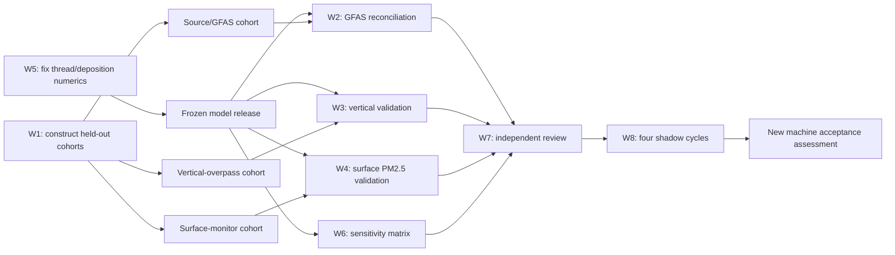

# CFFEPS–FLEXPART scientific acceptance research program

**Program ID:** `cffeps-flexpart-acceptance-program-v1`  
**Status:** W5 technically complete pending independent review; W1 input
inventory substantially complete but pending historical GFAS retrieval and
independent cohort review; no future acceptance result has been generated  
**Created:** 2026-07-24  
**Starting evidence:** [March–May 2026 validation results](../smoke-validation-results-2026.md)  
**Machine starting decision:** `not_accepted`

The integrated journal-style manuscript draft is
[Building a Performance-Blind, Provenance-Preserving Validation Framework for
CFFEPS–FLEXPART Wildfire Smoke Simulation over Canada](../research-paper-cffeps-flexpart-validation.md).
It combines the model theory, equations, implementation, pilot, numerical
investigation, expanded MISR cohort, assumptions, and remaining experiments
without representing incomplete holdout tests as results.

**Latest W3 update, 2026-07-27:** an exhaustive 2017-current MERLIN query
expanded the candidate pool to 388 fire-plume families. Under the unchanged
provisional observation rule, 109 qualify; 88 also have complete Fire M3
assignments and independent MCD64A1 area, spanning 37 MISR orbits. The
observation-availability shortage is resolved, but central-cohort clustering,
meteorology, causal emissions, and independent review remain incomplete. See
[the expanded MISR record](progress/2026-07-27-w3-expanded-misr-2017-current.md).

The earlier 16-orbit cohort remains immutable: its blinded machine QA and
causal CFFEPS histories produced 6 eligible cases versus the required 10. See
[the original W3 methods and results record](progress/2026-07-27-w3-blind-observation-and-causal-emissions.md).

## 1. Objective

Complete every scientific, numerical, review, and operational item that
blocked acceptance of the CWFIS–CFFEPS 4.1–FLEXPART 11.1 smoke system.

This is a prospective research program. The completed 2026 pilot remains
unchanged and cannot be retroactively converted into a passing experiment.
New cohorts, methods, thresholds, and software identities must receive new
protocol and candidate IDs.

## 2. Workstreams

| ID | Blocking issue | Research plan | Definition of done |
|---|---|---|---|
| W1 | Unrepresentative fire population | [Representative event population](01-representative-event-population.md) | At least 3 weak, 3 moderate, and 3 major eligible fires, spanning at least 2 ecozones and 2 fuel families |
| W2 | Unresolved GFAS source discrepancy | [GFAS source reconciliation](02-gfas-source-reconciliation.md) | Domain discrepancy is resolved by a frozen like-for-like attribution, or the full eligible-population comparison passes the unchanged gross-discrepancy criteria |
| W3 | No acceptance-capable vertical validation | [Vertical plume validation](03-vertical-plume-validation.md) | At least 10 independent MISR/lidar plume-overpasses meet the frozen bias, RMSE, and correlation gates |
| W4 | No final, adequately powered surface validation | [Surface PM2.5 validation](04-surface-pm25-validation.md) | At least 100 final NAPS station-hours meet the frozen NMB, NMAE, and correlation gates |
| W5 | One-thread non-finite deposition output | [Thread/deposition numerical investigation](05-thread-deposition-numerics.md) | Reproduced cause, reviewed fix, regression test, and finite valid outputs across the frozen thread matrix |
| W6 | Incomplete or ineffective sensitivities | [Sensitivity completion](06-sensitivity-completion.md) | Meaningful burned-area bounds, deposition factorial, and all required one-factor candidates complete and verify |
| W7 | Missing independent scientific review | [Independent scientific review](07-independent-scientific-review.md) | Emissions and air-quality reviewers sign; every blocking comment is resolved |
| W8 | Missing scheduled-cycle evidence | [Scheduled shadow cycles](08-scheduled-shadow-cycles.md) | Four consecutive preregistered validation cycles complete within their frozen windows |

The machine-readable tracker is
[`acceptance-evidence-matrix.yaml`](acceptance-evidence-matrix.yaml).

## Active research notebooks

Execution evidence is recorded as it is produced. These notebooks distinguish
observations from hypotheses, retain failed and negative results, and link to
machine-readable artifacts by path and checksum:

- [W5 thread/deposition investigation, started 2026-07-24](progress/2026-07-24-thread-deposition-investigation.md)
- [W1 input-only historical cohort inventory, started 2026-07-24](progress/2026-07-24-input-only-cohort-inventory.md)
- [Current W1/W5 closure status and remaining formal experiments](progress/2026-07-26-current-scientific-acceptance-status.md)
- [Consolidated W2/W3/W4/W6/W7/W8 execution plan, prepared 2026-07-26](remaining-w2-w8-execution-plan-2026-07-26.md)
- [Independent-review handoff for the formal sequence, prepared 2026-07-27](reviewer-handoff-2026-07-27.md)
- [W3 blinded MISR QA and causal pre-overpass emissions, 2026-07-27](progress/2026-07-27-w3-blind-observation-and-causal-emissions.md)
- [W3 exhaustive 2017-current MISR expansion, 2026-07-27](progress/2026-07-27-w3-expanded-misr-2017-current.md)
- [W3 expanded MISR publication update and draft language, 2026-07-27](w3-expanded-misr-publication-update-2026-07-27.md)
- [W3 exact reproduction runbook, 2026-07-27](w3-reproduction-runbook-2026-07-27.md)
- [W3 artifact, schema, and case-disposition dictionary, 2026-07-27](w3-artifact-data-dictionary-2026-07-27.md)

The W1 notebook is governed by a strict input-only boundary: no FLEXPART
candidate output or model-observation evaluation may be used to choose events,
years, or observation availability.

## 3. Program structure

W5 should be completed before the scientific holdout runs because the
one-thread failure affects confidence in complete model output. W1 can run in
parallel because it uses only input and observation availability, never
candidate performance. W2–W4 may run in parallel after the cohorts and model
release are frozen. W6 uses the same frozen cohorts and model identity. W7
reviews the complete evidence package. W8 demonstrates execution reliability
with that reviewed release.

## 4. Use three held-out cohorts

One short fire window is unlikely to contain representative fire sizes,
multiple MISR/lidar overpasses, and enough downwind final NAPS observations.
The program therefore uses three related but separately frozen cohorts:

1. **Source/GFAS cohort.** At least nine independently area-supported fires
   covering weak, moderate, and major strata. It evaluates source magnitude,
   species partition, and coverage.
2. **Vertical-overpass cohort.** Fires with quality-screened MISR MINX/MERLIN
   or lidar plume observations. The independent sample unit is a
   fire-overpass, not a satellite pixel.
3. **Surface-monitor cohort.** Fires whose fixed transport domain contains
   final hourly NAPS monitors and sufficient non-smoke background hours.

An event may appear in more than one cohort, but each cohort has an immutable
ledger and its own sample accounting. All cohorts use the same model
executable, source registry, fuel crosswalk, physical options, and evaluation
code. Cohorts may not be added or removed after their model results are
opened.

## 5. Candidate historical periods

Perform an input-only feasibility scan before choosing dates. The preferred
starting period is Canada's 2023 fire season because it contains extensive
major-fire and final surface-PM2.5 observations; Environment and Climate
Change Canada reports that 2023 regional PM2.5 peaks were strongly influenced
by the record wildfire season. It is not automatically selected: all required
CWFIS state, burned area, GFS/GDAS meteorology, GFAS, and observation products
must first pass a checksummed availability audit.

For vertical validation, the public NASA MISR Plume Height Project provides
MINX-generated plume files through MERLIN for several historical periods.
Additional events can be processed with the free MINX tool when raw MISR data
are available. A vertical cohort may consequently span more than one year.

If a historical CWFIS grid is unavailable, do not silently spatially fill it.
Either obtain the authoritative archive from NRCan, preregister and
independently review a station-based CFFDRS reconstruction, or exclude the
event before candidate output.

## 6. Program-wide research rules

### Separation of development and validation

- The 2026 pilot and any deliberately designated development cohort may be
  used to debug software and form hypotheses.
- Thresholds and observation operators for future holdout cohorts must be
  frozen before candidate outputs are opened.
- Calibration, if needed, occurs on a separate training cohort. The final
  acceptance cohorts remain untouched until the calibrated model is frozen.
- GFAS, MISR/lidar, and NAPS values never seed candidate emissions, injection,
  or event inclusion.

### Immutable attempts

Every attempt receives a unique candidate version and `attempt-NNN`
directory. A failed attempt is never overwritten. Any scientific change
requires a dated protocol amendment and a new candidate ID. Infrastructure
retries remain visible and distinguishable from scientific reruns.

### Independent sample units

- Source analysis: event-day and event totals, with grid-cell values retained
  as spatial diagnostics.
- Vertical analysis: one fire-overpass; pixels within a plume are clustered.
- Surface analysis: station-hours, with uncertainty resampled by event and
  station rather than treating every hour as independent.

The frozen legacy metrics remain the formal pass/fail gates. Clustered
confidence intervals are additional uncertainty estimates, not replacements
for those gates.

### Provenance

For every raw and derived artifact record:

- provider, product/version, URL or request, retrieval time, licence;
- filename, byte size, SHA-256, spatial and temporal coverage;
- variables, units, QA flags, transformations, and rejection counts;
- executable, source, patch, options, meteorology, release, seed, and output
  hashes; and
- command, environment, wall time, warning, exception, and attempt status.

Secrets and access tokens remain in environment variables and are never
written to a manifest.

## 7. Stage gates

### Gate A — feasibility

Before large downloads or model runs:

- identify at least 12 candidate fires so exclusions can occur without
  undermining the nine-event minimum;
- demonstrate authoritative area, fire state, meteorology, and at least one
  comparison source for each proposed event;
- estimate storage and model-member counts; and
- freeze the candidate-event ledger and exclusion rules.

### Gate B — protocol freeze

Before holdout model output:

- issue a new protocol ID and threshold YAML;
- freeze all cohort ledgers, data revisions, operators, metrics, sensitivity
  matrix, random seeds, thread matrix, and model identity;
- obtain pre-analysis sign-off from both independent reviewers; and
- run the machine validator for schema, hashes, completeness, and prohibited
  data leakage.

### Gate C — central results

Run the central source/GFAS, vertical, and surface cohorts exactly once unless
an attempt fails for a preregistered invalidation reason. Generate all pair
tables and evaluations automatically. Do not inspect an observation to decide
whether an event remains included.

### Gate D — robustness

Run the frozen sensitivity matrix. Every candidate must pass complete-output
verification. Report both pass/fail changes and continuous metric changes.

### Gate E — external review and cycles

Resolve independent-review comments, tag the reviewed release, and execute
four scheduled shadow cycles. Then build a new machine-readable assessment.
The software must not change its own production-write setting; a human
governance decision follows the evidence.

## 8. Acceptance criteria retained from the frozen protocol

| Component | Minimum sample | Required metrics |
|---|---:|---|
| GFAS source diagnostic | 20 active-union cell-days | `-0.75 <= NMB <= 2.0`, `R >= 0.30`, `FAC2 >= 0.25` |
| MISR/lidar plume height | 10 independent plume-overpasses | `-1,000 m <= MB <= 1,000 m`, `RMSE <= 2,000 m`, `R >= 0.40` |
| Final NAPS PM2.5 enhancement | 100 station-hours | `-0.30 <= NMB <= 0.30`, `NMAE <= 0.50`, `R >= 0.40` |

The event design requires at least three fires in each of the weak
`<100 ha`, moderate `100–1,000 ha`, and major `>1,000 ha` strata, with at
least two ecozones and two fuel families.

## 9. Expected effort

These are planning ranges, not commitments:

| Work | Active effort | Principal uncertainty |
|---|---:|---|
| W5 numerical investigation | 1–3 person-weeks | Reproducing the non-finite wet-deposition path |
| W1 cohorts and acquisition | 2–5 person-weeks | Historical CWFIS and vertical-product completeness |
| W2 GFAS reconciliation | 1–3 person-weeks | Event support and residual source discrepancy |
| W3 vertical validation | 3–8 person-weeks | Manual MINX plume processing and independent QA |
| W4 NAPS surface validation | 2–4 person-weeks | Final archive coverage and smoke-background screening |
| W6 sensitivity completion | 1–3 person-weeks plus compute | Defensible independent burned-area bounds |
| W7 review | 2–6 calendar weeks | Reviewer availability and issue resolution |
| W8 scheduled cycles | At least 4 cycle windows | Upstream data latency and orchestration reliability |

With partial parallelism, the program is likely a multi-month research effort.
Data inventory and reviewer recruitment should start immediately because they
have the longest external lead times.

## 10. Immediate launch sequence

The first two weeks should start three tracks in parallel without opening new
holdout model output:

### Track A — numerical evidence

1. Freeze the W5 failing member and environment.
2. Extract the two invalid wet-deposition cells.
3. Run exact one-thread replays and the 1/2/4/8 thread matrix.
4. Begin instrumented-build diagnosis.

### Track B — input-only cohort inventory

1. Catalogue candidate 2023 fires and at least one alternate historical
   period.
2. Check MCD64A1/VNP64A1, CWFIS state, NOAA meteorology, GFAS, MISR/lidar,
   and final NAPS availability without reading model performance.
3. Produce a preliminary 12–15-event feasibility ledger.
4. Estimate downloads, storage, model members, and manual MINX workload.

### Track C — governance

1. Recruit the emissions and air-quality reviewers.
2. Give them the pilot results, this program, and the proposed cohort rules.
3. Resolve objections to the sampling design and numerical acceptance
   criteria before the successor protocol is frozen.

The first formal milestone is not a model run. It is a signed feasibility
package containing a reproducible W5 diagnosis plan, input-complete candidate
cohorts, reviewer identities, storage/compute estimates, and the draft
successor protocol.

## 11. Official source anchors

- [NASA MCD64A1 Collection 6.1 user guide](https://www.earthdata.nasa.gov/s3fs-public/2025-04/MCD64_User_Guide_V61.pdf)
- [NASA VNP64A1 Version 2 release](https://forum.earthdata.nasa.gov/viewtopic.php?t=6121)
- [NRCan CWFIS data catalogue](https://cwfis.cfs.nrcan.gc.ca/datamart)
- [NOAA NCEI GDAS archive](https://www.ncei.noaa.gov/products/weather-climate-models/global-data-assimilation)
- [CAMS GFAS v1.4.2 documentation](https://confluence.ecmwf.int/spaces/CKB/pages/601301528/CAMS+global+biomass+burning+emissions+based+on+fire+radiative+power+GFAS+data+documentation)
- [NASA ASDC MISR MERLIN/MINX access](https://asdc.larc.nasa.gov/news/merlin-a-new-tool-for-misr-plume-height-project-access-and-analysis)
- [ECCC NAPS open-data record](https://open.canada.ca/data/en/dataset/1b36a356-defd-4813-acea-47bc3abd859b)

These links are discovery anchors. Every actual acquisition must store the
specific product version, request, retrieval time, and checksum.
