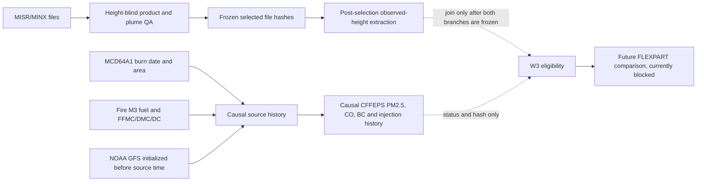

# W3 blinded MISR observation QA and causal pre-overpass emissions

**Date:** 2026-07-27  
**Protocol:** `cffeps-flexpart-successor-holdout-2026-v1`  
**Status:** machine analysis complete; formal W3 execution blocked  
**Formal eligible sample:** 6 of 10 required fire-overpasses  
**FLEXPART output opened:** no

Companion documentation:

- [exact reproduction runbook](../w3-reproduction-runbook-2026-07-27.md);
- [artifact, schema, and complete case-disposition dictionary](../w3-artifact-data-dictionary-2026-07-27.md); and
- [independent-review handoff](../reviewer-handoff-2026-07-27.md).

**Later availability update:** the immutable 16-orbit result documented here
still contains 6 fully prepared cases, but it no longer describes the
available observation pool. An
[exhaustive 2017-current MERLIN expansion](2026-07-27-w3-expanded-misr-2017-current.md)
identified 109 observation-qualified and 88 source-area-qualified candidates.
That newer pool still requires clustering, meteorology, causal histories, and
independent review.

## Executive finding

The W3 observation and source branches were processed without consulting
FLEXPART height or performance:

- 16 prospectively catalogued MISR overpasses entered the workflow;
- one was already input-invalid because it lacked independent MCD64A1 area;
- 15 source-linked MINX plume files were selected without parsing height
  columns;
- the selected file was always the blue-band land-smoke retrieval: 12 carried
  provider quality `Good`, and 3 carried `Fair`;
- a post-selection extraction rule requiring at least 10 wind-corrected AGL
  retrievals at or above 250 m retained 6 observations;
- 14 cases obtained strictly pre-overpass source histories;
- 13 cases obtained hourly, time-varying CFFEPS PM2.5, CO, black-carbon, and
  vertical-injection histories; and
- the status-only intersection contains 6 cases, below the frozen formal
  minimum of 10.

No QA threshold, band, plume, source, or area was changed to recover the
sample after these counts became known. No FLEXPART result was opened.
Consequently this work is a reproducible blinded machine analysis, but it is
not an independent-scientist signoff and it does not authorize the formal W3
experiment.

## Independence and conflict disclosure

The user requested an independent-scientist analysis. The analyst executing
this work cannot truthfully supply institutional or personnel independence:

1. the same Codex agent implemented parts of the observation, source, and
   CFFEPS adapters;
2. in an earlier implementation session, the first lines of one raw MINX file
   were displayed and its header contained observational height summaries;
3. during this analysis, the agent saw post-selection counts of valid
   retrievals, although not their height magnitudes; and
4. the agent has not opened the sealed observation-height ledger or any
   FLEXPART holdout output during this analysis.

The technical firewall is nevertheless meaningful. The file-selection parser
does not parse MINX result columns 10–12, its unit test replaces those fields
with non-numeric `SECRET` tokens, and the readiness join never opens the
observation ledger. This reduces model-informed selection risk but does not
replace the independent human review required by W7.

An external emissions/plume scientist must decide whether the earlier header
viewing and the provisional measurement-validity rule are acceptable. If not,
the present W3 cohort must be retired rather than repaired according to model
agreement.

## Scientific question and separation of branches

The task has two branches that must remain separate until both are frozen:



The observation branch answers, “Which independent MISR measurement is valid?”
The source branch answers, “What could the model have emitted by the satellite
overpass?” MISR heights do not seed CFFEPS injection, and CFFEPS/FLEXPART
heights do not select MISR measurements.

## Observation methodology

### Literature basis

MINX derives stereo heights and winds through manual plume delineation,
multi-camera image matching, and wind correction. Under good conditions its
vertical precision is approximately 200 m. See
[Nelson et al. (2013)](https://doi.org/10.3390/rs5094593).

The global MINX analysis retained provider-quality `Good` and `Fair` plumes
and selected the superior band for each region; blue was superior for 94% of
predominantly land-smoke plumes. It also notes that many rejected plumes had
only a few successful retrievals, but it does not define a universal
ten-retrieval cutoff. See
[Martin et al. (2018)](https://www.mdpi.com/2072-4292/10/10/1609).

Prior plume-model comparisons establish that MISR/MINX can be used to evaluate
plume rise, but the observed and model quantities must be defined consistently.
Examples include
[Val Martin et al. (2012)](https://doi.org/10.3390/atmos3010103) and
[Vernon et al. (2018)](https://doi.org/10.5194/amt-11-6289-2018).

### Height-blind inputs

For each prospectively frozen overpass, the observation selector received:

- the two MINX region names linked to the frozen source, normally one blue and
  one red retrieval;
- file identity and checksum;
- orbit, acquisition time, product version, aerosol type, geometry type, and
  categorical provider retrieval quality;
- polygon coordinates;
- raw result-row identities, locations, and terrain-value validity; and
- the frozen Fire M3 source coordinate.

The selector did **not** accept MINX height values, CFFEPS heights, FLEXPART
output, or performance statistics as inputs.

### Frozen blind checks and rank

A candidate had to satisfy all of the following:

1. exact orbit, acquisition time, and source-linked region identity;
2. MINX V4.0 smoke polygon;
3. provider retrieval quality `Good` or `Fair`;
4. at least 10 raw result rows;
5. positive provider successful-retrieval count no larger than the number of
   raw result rows;
6. nondegenerate polygon; and
7. frozen source inside the polygon or no farther than 5 km from it.

Candidates were ranked by:

1. `Good` before `Fair`;
2. blue before red for land smoke;
3. more raw rows; then
4. region name.

There is no fallback to the alternate band after height extraction.

The first blind-QA run incorrectly required the provider successful-retrieval
count to equal the number of raw result rows. The provider count describes
successful retrievals, while the result section can include additional
attempts. That run rejected every case before any height extraction. The
mechanical check was corrected to
`0 < provider successful count <= raw row count`, documented, retested, and
rerun as r2. No height value was inspected to make this correction.

### Post-selection extraction

Only after the r2 file hashes were frozen did the extraction process parse:

- wind-corrected MINX height as the primary measurement;
- terrain height from the same retrieval row;
- AGL height as `wind-corrected ASL - terrain ASL`; and
- the median of valid AGL retrievals as the overpass statistic.

The executed rule required:

- AGL at least 250 m; and
- at least 10 valid retrievals in the already selected file.

This rule was frozen before the extraction produced the case counts, but it
was not approved by an independent reviewer and is scientifically stricter
than the explicit published `Good`/`Fair` criterion. In particular, the
published 250–500 m vertical resolution does not by itself establish that a
physically low 0–250 m AGL retrieval is invalid. Therefore the six-case result
is a conservative provisional analysis, not a basis for quietly changing the
threshold on this cohort.

An external reviewer has two defensible choices:

1. accept the present rule and conclude that this cohort is too small; or
2. preregister a literature- and uncertainty-supported rule, then apply it to
   a new or otherwise untouched cohort.

Changing this cohort's threshold because a value of two, three, or another
number happens to restore the ten-case minimum would be outcome-dependent
selection.

### Post-selection audit counts

No observed height magnitudes are reproduced here.

| Overpass | Selected-file valid count under executed rule | Disposition |
|---|---:|---|
| `2017-O093614` | 19 | frozen |
| `2017-O093687` | 10 | frozen |
| `2017-O093717` | 19 | frozen |
| `2017-O093745` | 3 | measurement-invalid |
| `2017-O093819` | 1 | measurement-invalid |
| `2017-O093877` | 3 | measurement-invalid |
| `2017-O093919` | 14 | frozen |
| `2017-O093978` | 0 | measurement-invalid |
| `2018-O098477` | 47 | frozen |
| `2018-O098506` | 4 | measurement-invalid |
| `2018-O098725` | not extracted | prior input exclusion |
| `2018-O099017` | 0 | measurement-invalid |
| `2018-O099032` | 0 | measurement-invalid |
| `2018-O099061` | 4 | measurement-invalid |
| `2018-O099221` | 2 | measurement-invalid |
| `2018-O099337` | 104 | frozen |

## Causal source-history methodology

Let `T` be the exact MISR overpass time. The source-history window is:

```text
[T - 24 hours, T]
```

### MCD64A1 area

For MCD64A1 daily central increment `A(d)` on UTC day `d`, the area assigned to
an interval `[a, b]` within that day is:

```text
A(d) × seconds(overlap([a, b], day d)) / 86,400
```

The final MCD64A1 product is retrospective. Every daily increment is clipped
at `T`; the part of the burn day after `T` is excluded and never shifted into
an earlier interval. Central, high-confidence, earliest-timing, and
latest-timing curves are retained separately.

This establishes **physical event-time causality** for a retrospective
validation. It does not establish **operational data-availability causality**,
because final MCD64A1 is published after the fire.

### Fire M3 fuel and fire-weather state

Fuel is frozen from the source-linked Fire M3 record and mapped through the
versioned CWFIS-to-FBP crosswalk.

For each source segment beginning at time `t`, the fire-weather state is:

```text
S(t) = latest complete Fire M3 FFMC/DMC/DC record
       within 5 km with observation time <= t
```

A 24-hour lookback before the history window is allowed to initialize a fire
that was already active. If no admissible state exists at a segment start, its
area is withheld. It is not assigned a later state and is not moved to another
time.

Segment boundaries occur at:

- the start and end of the 24-hour history;
- every UTC hour; and
- every admissible Fire M3 observation time.

### NOAA GFS meteorology

Meteorology comes from the historical NOAA GFS GDEX global 0.25-degree
archive. For each source hour:

- only a cycle initialized at or before that source time is eligible;
- when cycles overlap, the newest already-initialized cycle is used;
- spatial sampling is at the nearest grid point;
- three-hour fields are linearly interpolated to hourly profiles; and
- temperature and geopotential height are interpolated onto 40
  log-pressure levels.

Each segment stores the GFS cycle initialization time, valid time, manifest
hash, surface humidity, wind speed, dew point, elevation, and the complete
pressure/temperature/height profile.

### Machine causality assertions

Every event history asserts:

- every segment starts before `T`;
- every segment ends no later than `T`;
- every Fire M3 state was observed no later than the segment start;
- every GFS cycle initialized no later than the segment start; and
- no positive-area segment extends after `T`.

All assertions passed for every constructed history.

## Causal CFFEPS translation

### Why the portable driver changed

The earlier portable CFFEPS interface held FFMC, DMC, and DC constant for a
run. That is inadequate for an explicitly causal history because a state
observed later in the day must not alter earlier emissions.

The driver now accepts an optional headerless `fire_weather_state_path` with
one `FFMC DMC DC` record per meteorological profile hour. Immediately before
each CFFEPS step it:

1. loads the state selected at or before that hour;
2. validates FFMC, DMC, and DC;
3. recomputes BUI; and
4. calls the unmodified CFFEPS 4.1 scientific kernel.

The BUI update follows the CFFEPS/Canadian FWI relationship:

```text
if DMC <= 0.4 × DC:
    BUI = 0.8 × DMC × DC / (DMC + 0.4 × DC)
else:
    BUI = DMC - (1 - 0.8 × DC / (DMC + 0.4 × DC))
                × (0.92 + (0.0114 × DMC)^1.7)
```

It also accepts a nonnegative, nondecreasing cumulative-area value for every
hour. Each source step therefore sees only area allocated through the end of
that step. It does not see the fire's later pre-overpass size.

When no hourly state file is supplied, the legacy constant-state path is
unchanged. Ten CFFEPS golden cases remain byte-for-byte unchanged. A new
verification shows that a repeated constant hourly state reproduces the
legacy output, that a repeated constant hourly area does the same, and that
deliberately varying state and area profiles change the result.

An initial r1 emission pass varied fire weather and excluded post-overpass
area, but still supplied total pre-overpass area to CFFEPS as a constant
`estarea`. The integrity review identified that an early source hour could
therefore use the fire's later pre-overpass size in its plume-rise calculation.
This did not leak information from after the satellite overpass, but it was
weaker than a sequential causal history. The r1 bundles are retained as a
superseded audit trail. The final r2 bundles use hourly cumulative area and all
results below refer to r2.

### Hourly causal adapter

CFFEPS operates on hourly meteorological profiles. For each source history:

1. the first partial hour is omitted rather than moved;
2. modelling begins at the first whole UTC hour with a state already observed;
3. every hour uses the latest Fire M3 state observed at or before that hour;
4. the MCD64A1 released-area curve is integrated over those same hours;
5. active-interval conservation is disabled, because moving area out of an
   inactive interval could make later evidence alter earlier emissions;
6. the final hour's area curve becomes flat at the exact overpass; and
7. every final release interval is clipped to end exactly at or before the
   overpass.

CFFEPS maps fuel, area, fire weather, wind, moisture, and the thermodynamic
profile into phase-resolved fuel consumption and plume rise. The versioned
emission-factor registry then maps flaming, smouldering, and residual fuel
consumption into PM2.5, CO, and black carbon. The frozen
`cffeps_top_beta_v1` profile distributes each phase vertically.

No CFFEPS plume-height value was used to select or reject a MISR observation.
No FLEXPART run was performed by this operator.

## Results

### Causal source histories

Of 16 prospective overpasses:

- 14 have a positive, time-causal central source history;
- `2017-O093877` has zero central MCD64A1 area in the exact pre-overpass
  24-hour interval; and
- `2018-O098725` retains its prior independent-area exclusion.

Across all constructed source histories:

- central MCD64A1 area inside the 24-hour windows: `8,473.843675 ha`;
- central area released with an available causal state: `8,278.211611 ha`;
- central area withheld because no prior state existed: `195.632064 ha`; and
- central area belonging to post-overpass portions of MCD64A1 days and
  explicitly excluded: `40,498.419591 ha`.

The large post-overpass number is expected when a daily burned-area product
assigns substantial area to the same UTC day after a daytime overpass. It is
reported to make the no-leakage operation measurable.

### Causal CFFEPS emission histories

Thirteen overpasses produced complete emission bundles:

- `2017-O093877` was excluded by the zero-area source history;
- `2018-O098725` was excluded by the prior input failure; and
- `2018-O098506` had a valid sub-hour causal state only very near overpass,
  but no whole CFFEPS hour at which that state was already available. Its
  `2.176400 ha` was omitted, not shifted.

For the 13 ready bundles:

- source-history released central area: `8,276.035211 ha`;
- hourly represented area: `8,130.326444 ha`;
- area omitted because of the conservative sub-hour/hourly-state rule:
  `145.708767 ha`;
- PM2.5: `7,741,816.321 kg`;
- CO: `51,117,833.021 kg`; and
- black carbon: `111,273.976 kg`.

All 13 NetCDF bundles pass structural, finite-mass, non-negative-mass, and
vertical-fraction validation. Every emission interval ends no later than its
overpass.

These masses are exploratory source-model outputs. They are not observational
truth, have not been compared with MISR heights, and do not constitute W3
performance results.

### Formal eligibility

The status-only readiness join uses:

- blind file-selection status;
- post-selection measurement-validity status and count;
- causal source-history status;
- causal CFFEPS emission-history status; and
- artifact hashes.

It never opens the sealed observed-height ledger. Six overpasses pass all four
machine gates. The protocol requires at least ten, so:

```text
formal_execution_permitted = false
sample_size_gate_passed = false
independent_review_gate_passed = false
```

## Reproducible artifact inventory

| Artifact | SHA-256 |
|---|---|
| W3 input-only assignment r2 | `ce541e36a02cf7e54ab56a2b58708705830263f0828ce5359108ef7f87060d15` |
| Historical GFS GDEX ledger r2 | `55e083f1de456100a2e0588e442223e9b381fe6d633cfc98820a9a6abecbd5a0` |
| Fire M3 2017 archive | `cd6f01d10e8719ad23e9b15f5a4b8330e949c938c488c4733c11459536f8481c` |
| Fire M3 2018 archive | `3d4659e36c994cea4a6ddc18d1d057358828aa5d9f893c7e3682c7219096b131` |
| Height-blind MINX QA r2 | `6f2ef2890e6f999be47b74f28e7c49e49c9045924c656332673caa7352b8d6dc` |
| Sealed MINX observation ledger r1 | `777c6e5f926b25f15f18357fc61a9ed0c5471b491542d6d04975f7b15db21013` |
| MINX extraction audit r1 | `e0328527bb1317282f196144d8773e2aaf6ac234db7628c09e002013a8700bfd` |
| Causal source-history ledger r1 | `de50536131b4526b6b49943b73dc52894474a7b6ec83a89449c1fc6f4e76b0d0` |
| Superseded causal CFFEPS emission ledger r1 | `31459f796f4047a2c2ac362ec24a6e888106e3df41b34df2a25839d7ab2dee3b` |
| Final causal CFFEPS emission ledger r2 | `18c7a97be1c60c8bf724ea1df7e58853179341d093b6840a899b1dee961d6522` |
| Final blinded W3 readiness r3 | `73d6ad2319af348417587a68729e16519249bcf4a4e8a39d65122f2c4e818104` |
| CFFEPS executable used by r2 | `7934e39783f27ac74411349e8de2d5a978073bee6182a2abc0e70be2891cd96c` |

The analysis directory is:

```text
/Volumes/BigMrStorage/weatherapp_data/weather/derived/smoke/validation/
  readiness/cffeps-flexpart-successor-2026-v1/w3-blind-analysis/
```

The principal implementation files are:

```text
python/weather_ingest/minx_blind_qa.py
python/weather_ingest/w3_causal_history.py
python/weather_ingest/w3_readiness.py
python/weather_ingest/cffeps.py
scripts/build_w3_blind_minx_qa.py
scripts/build_w3_minx_observations_from_blind_qa.py
scripts/build_w3_causal_emission_histories.py
scripts/build_w3_causal_cffeps_emissions.py
scripts/build_w3_blinded_readiness.py
cffeps/src/weatherapp_cffeps_driver.f90
```

## Verification performed

Focused Python verification:

```text
19 passed
```

It covers:

- the height-blind MINX parser;
- causal area clipping;
- time-causal Fire M3 state selection;
- hour-boundary omission rather than area shifting;
- status-only readiness joining;
- emission-area scaling; and
- existing smoke pipeline behaviour.

CFFEPS verification:

```text
PASS: 10 CFFEPS 4.1 golden cases and 6 FBP sensitivity cases;
hourly causal fire-weather and estimated-area profiles verified
```

Each of the 13 generated NetCDF emission bundles also passed
`validate_emission_bundle`.

The final repository-wide regression result was:

```text
273 passed, 19 skipped, 11 warnings
```

The 19 skips are PostgreSQL integration tests for which
`WEATHER_TEST_DATABASE_URL` was not configured. The warnings are existing
NumPy/rasterio deprecation or georeferencing warnings, not W3 failures.

Documentation-integrity verification performed after the final record,
runbook, data dictionary, reviewer handoff, and acceptance tracker were
updated:

```text
local Markdown links: 31 checked, 0 missing
documented SHA-256 values: 28 checked, 28 matched
acceptance-evidence-matrix.yaml: parsed successfully
W3 tracker state: 6 eligible, 10 required, formal execution false
Ruff on the documented W3 implementation set: passed
```

## Remaining scientific decisions

Formal W3 must not proceed until all of the following are resolved:

1. **Independent observation review.** An external plume scientist reviews all
   16 cases, the earlier header-viewing deviation, source assignment, polygon,
   band, terrain, wind correction, and rejection rules.
2. **Measurement-validity rule.** The reviewer decides prospectively whether
   the 250 m AGL floor and ten-valid-retrieval minimum are scientifically
   justified. The current cohort is not used to tune a replacement.
3. **Sample expansion or formal failure.** If the executed rule stands, add a
   newly frozen, performance-unseen cohort until at least ten cases survive,
   or record W3 as failed for insufficient sample.
4. **Causal-source review.** Reproduce at least one MCD64A1 partition, Fire M3
   state sequence, GFS profile, and CFFEPS bundle. Decide whether the
   conservative hourly omissions and physical-versus-operational causality
   label are acceptable.
5. **Protocol/package refreeze.** Freeze the reviewed observation operator,
   time-varying CFFEPS interface, ledgers, executable, and code hashes in a new
   successor protocol/review package.
6. **Only then run FLEXPART.** Sample the still-unopened W3 transport output at
   the frozen MISR polygons and overpass times. Report every exclusion and the
   primary metrics even if they fail.

The present result supplies a reproducible scientific dossier for those
decisions. It does not supply the independent decisions themselves.
