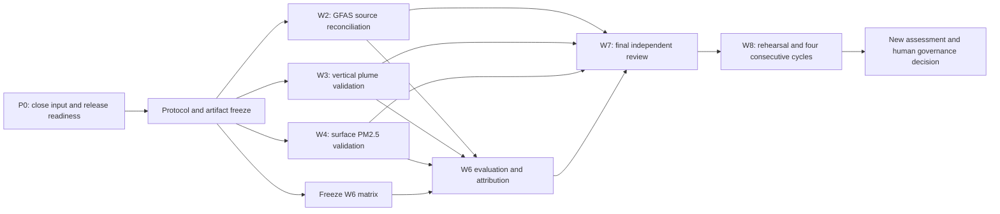

# Execution plan for remaining W2, W3, W4, W6, W7, and W8 work

**Program:** `cffeps-flexpart-acceptance-program-v1`  
**Plan version:** 1  
**Prepared:** 2026-07-26  
**Overall status:** not scientifically accepted  
**Production and interactive simulation writes:** remain disabled  
**Governing workstream plans:** [W2](02-gfas-source-reconciliation.md),
[W3](03-vertical-plume-validation.md), [W4](04-surface-pm25-validation.md),
[W6](06-sensitivity-completion.md),
[W7](07-independent-scientific-review.md), and
[W8](08-scheduled-shadow-cycles.md)

## 1. Purpose

This document turns the six remaining workstream research plans into one
sequenced implementation and experiment plan. It defines:

- the prerequisites that must close before holdout results are opened;
- the code and data products to build;
- the formal experiments and immutable artifacts to produce;
- the acceptance criteria and failure paths;
- the human review that software cannot perform; and
- the order in which work may safely run in parallel.

This plan does not change any scientific threshold. It also does not claim
that W1 or W5 has received independent scientific approval. W5's machine work
is technically complete, while its independent numerical and physical review
is part of W7.

## 2. Verified starting position

### Inputs and software already available

| Evidence | Current state |
|---|---|
| W1 source-event design | 9 retained and 6 reserve events; retained design has 3 weak, 3 moderate, and 3 major events across 6 ecozones and 3 fuel families |
| Independent burned area | 138 MCD64A1 v061 and 203 VNP64A1 v002 granules are local and checksummed |
| Historical source meteorology | 102 GFS cycles, 918 files, and 40,927,328,307 bytes are complete for the retained/reserve 2023 source dates |
| Vertical observation availability | 16 prospectively selected 2017–2018 MISR orbit overpasses and 114 raw MINX plume files are local and checksummed |
| Surface observation availability | Final 2023 NAPS archive; 231 prospective stations and 951,598 prospective May–October station-hours |
| FLEXPART numerical correction | W5 root cause, code correction, focused regression, 22-case compact suite, and 48-attempt frozen-member matrix are technically complete |
| ADS access | `ADS_PERSONAL_ACCESS_TOKEN` authenticated successfully against ADS and the CAMS GFAS collection on 2026-07-26; no W1 GFAS retrieval has yet been frozen |

### Important remaining readiness gaps

1. GFAS v1.2 daily analysis for the 77 retained/reserve 2023 source dates has
   not yet been downloaded, verified, and frozen.
2. `source-gfas-ledger.json`, the final exclusion ledger, and the successor
   protocol hashes do not yet exist.
3. An independent reviewer has not yet signed the no-performance-selection
   audit or approved opening holdout output.
4. The 16-overpass W3 availability ledger does not by itself establish
   complete CWFIS/CFFEPS and meteorological inputs for the corresponding
   2017–2018 fires. That completeness must be demonstrated before W3 model
   runs.
5. W5's fixed release and thread-equivalence tolerance have not received
   prospective independent review.
6. Most of the workstream-specific pairing and evaluation modules named in
   the research plans do not yet exist. The existing foundations include the
   GFAS bundle/pair builders, general smoke candidate runner/verifier, NAPS
   downloader, MISR availability freezer, and validation DAG.

## 3. Non-negotiable execution rules

- Do not open holdout FLEXPART output until the successor protocol, cohort
  ledgers, operators, sensitivity matrix, and model release are hashed and
  both W7 reviewers have approved prospective execution.
- Do not use GFAS, MISR/lidar, or NAPS values to seed emissions, set injection,
  select retained events, or tune matching rules.
- Keep development/calibration data separate from the final holdout cohorts.
- Give every scientific run a candidate ID and every attempt an immutable
  attempt ID. Never overwrite a failure.
- Freeze primary and sensitivity operators before calculating performance.
- Preserve every exclusion and its reason.
- Verify every candidate with the schema-v2 whole-output verifier before
  scientific evaluation.
- Report failed central experiments as failures. A favourable sensitivity
  cannot replace a failing central result.
- Keep `SIMULATION_WRITES_ENABLED=false`. W8 uses the validation namespace and
  cannot unlock production.
- Record commands, environments, input and output SHA-256 values, model
  executable hashes, warnings, runtimes, and reviewer dispositions.

## 4. Critical path and permitted parallel work



W2, W3, and W4 can be implemented and executed in parallel after the common
freeze. The W6 design must be frozen at the same time, but final W6
interpretation depends on the central W2–W4 results. W7 starts immediately
with protocol review and continues throughout; final W7 approval follows all
scientific results. W8 starts only after the reviewed release is tagged.

## 5. Phase 0 — close readiness before holdout output

**Target effort:** 3–7 active days plus reviewer turnaround  
**Exit artifact:** signed, checksummed protocol-freeze package

### 5.1 Retrieve and freeze the missing GFAS source data

Build an ADS downloader that:

1. reads `ADS_PERSONAL_ACCESS_TOKEN` without printing it;
2. requests CAMS GFAS v1.2 daily analysis for the 77 frozen positive-area
   retained/reserve dates;
3. retrieves, where supplied by the product, `pm2p5fire`, `cofire`, `bcfire`,
   `crfire`, `frpfire`, `offire`, `injh`, `apt`, and `apb`;
4. records the exact ADS dataset ID, request JSON, product/version, licence,
   retrieval time, temporal convention, grid, units, byte size, and checksum;
5. validates GRIB structure, date coverage, parameter coverage, finite values,
   non-negative emission fields, and absence of duplicate date/parameter
   messages; and
6. writes atomically into the immutable validation input archive.

The request should retrieve only the frozen dates and scientifically required
fields unless the ADS API requires a larger indivisible unit. GFAS values must
remain unread by event selection code.

### 5.2 Finalize the W1 source/GFAS completeness ledger

- Join the already frozen source candidate ledger to GFAS availability flags,
  not GFAS magnitudes.
- Prove per retained source day that area, fuel, FFMC, DMC, DC, GFAS, and all
  required meteorology exist and have valid hashes.
- Apply the previously declared reserve/substitution policy only for
  input-invalid events, never for poor model agreement.
- Freeze:

  ```text
  cohorts/<successor-cohort-id>/
    source-gfas-ledger.json
    vertical-cohort-ledger.json
    surface-cohort-ledger.json
    exclusion-ledger.json
    input-completeness.json
    cohort-freeze.json
  ```

### 5.3 Close W3 input readiness

For each proposed 2017–2018 MISR overpass:

- assign the plume to a fire using location, time, provider fire records, and
  frozen geometry without reading plume height or model output;
- prove availability of fuel, fire state, independent area, and sufficient
  spin-up/transport meteorology;
- catalogue at least 20 potential overpasses if possible, because the current
  16 can fall below the formal minimum of 10 after plume QA and pairing;
- otherwise preregister that 16 is the complete candidate pool and define the
  outcome if fewer than 10 survive; and
- freeze all acquisition requests, exclusions, and overpass identities.

If necessary inputs cannot be reconstructed defensibly for an overpass,
exclude it before output and replace it only under the frozen input-only rule.

### 5.4 Freeze the corrected model release

Create one release manifest containing:

- FLEXPART source, W5 patch, compiler, libraries, build flags, and executable
  hashes;
- CFFEPS source/executable and emission registry versions;
- fuel crosswalk, CFFDRS sampling, area operator, injection scheme, species
  and deposition settings;
- domain, meteorology conversion, release/output interval, particles, thread
  policy, and seed policy;
- candidate runner and whole-output verifier hashes; and
- the prospectively reviewed thread-equivalence engineering tolerance.

The one-thread zero-skew fix requires independent numerical confirmation that
it is the defined CBL limit and independent emissions-science confirmation
that it is not output sanitization.

### 5.5 Freeze the successor protocol

Issue a new protocol and candidate ID. Freeze:

- W2–W4 cohort identities and roles;
- all primary observation operators and rejection rules;
- the unchanged acceptance thresholds;
- bootstrap units and random seeds;
- the complete W6 candidate matrix and allowed one-factor differences;
- permitted invalidation/retry reasons;
- planned tables, figures, and subgroup analyses; and
- permitted and prohibited scientific claims.

Both required W7 reviewers must resolve every pre-execution blocking comment
and sign the artifact hashes before holdout output is opened.

### Phase 0 gate

Phase 0 passes only when a machine preflight reports:

```text
all_required_inputs_complete = true
cohorts_frozen = true
model_release_frozen = true
operators_and_thresholds_frozen = true
sensitivity_matrix_frozen = true
reviewer_approval_to_execute = true
holdout_output_opened_before_freeze = false
```

## 6. Common implementation spine

Build shared infrastructure before duplicating logic in the workstreams:

1. **Observation contract.** Common IDs, UTC intervals, geometry, units, QA,
   rejection reason, source checksum, model interpolation, and acceptance
   role.
2. **Immutable pair contract.** Pair file, source manifest, candidate manifest,
   operator version, inclusion/exclusion counts, and pair checksum.
3. **Statistics library.** Reuse the existing metric definitions; add
   event-block and event/station multiway bootstrap with fixed seeds.
4. **Rejection ledger.** Machine-readable enumerated reason codes with totals
   that reconcile input records to retained pairs.
5. **Artifact builder.** Atomic writes, checksum manifests, candidate/attempt
   identity, and environment capture.
6. **Leakage checker.** Verify that selection and mask builders cannot accept
   candidate output or observed magnitudes.
7. **Golden fixtures.** Small synthetic GFAS grids, MINX plumes, NAPS
   station-hours, and FLEXPART fields with analytically known expected pairs.

Required testing layers:

- unit tests for units, time conventions, areas, interpolation, QA, metrics,
  and rejection rules;
- deterministic golden-pair tests;
- candidate/config difference tests;
- malformed/missing/duplicate input tests;
- complete-output verification on every generated member;
- Airflow/database integration tests when
  `WEATHER_TEST_DATABASE_URL` is available; and
- reproduction from an empty derived-artifact directory using only frozen
  inputs and documented commands.

## 7. W2 — GFAS source reconciliation

**Active effort:** 1–3 person-weeks  
**Primary unit:** grid-cell-day; event-day and event totals are additional  
**Minimum:** 20 active-union cell-days

### Implementation

Add:

```text
python/weather_ingest/gfas_event_support.py
scripts/build_gfas_event_support.py
scripts/evaluate_gfas_source_attribution.py
tests/ingestion/test_gfas_event_support.py
```

Extend the existing GFAS bundle and pair builders without changing the
reproduction of the original domain-active-union operator.

The support builder must consume only frozen event/area ledgers and the GFAS
grid. It must reject candidate-output paths. Build:

- exact independently supported event-cell-day masks;
- one preregistered geolocation/resolution dilation;
- ambiguous/unassigned masks; and
- a closure table partitioning domain mass into supported, outside, and
  ambiguous/unassigned components.

### Formal experiment

For PM2.5, CO, and BC:

1. reproduce the original domain-active-union comparison;
2. calculate exact-support grid-cell-day pairs;
3. calculate the frozen dilation sensitivity;
4. aggregate event-day and event-total masses;
5. decompose differences into area, consumed dry matter, emission factor,
   species ratio, timing/pending phase, FRP/observed fraction, and unmatched
   coverage terms; and
6. event-block-bootstrap the secondary uncertainty statistics.

GFAS FRP, emissions, or injection height may not enter CFFEPS/FLEXPART input.

### Acceptance

For every species, require:

- `N >= 20`;
- `-0.75 <= NMB <= 2.0`;
- Pearson `R >= 0.30`; and
- `FAC2 >= 0.25`.

W2 closes if the full eligible-population domain comparison passes, or if the
like-for-like comparison passes and the domain discrepancy is quantitatively
closed by mass outside the supported event masks with both reviewers agreeing
that no substantial matched-event discrepancy remains.

If neither outcome occurs, W2 fails. Diagnose on a separate training cohort;
do not tune the frozen holdout mask, factors, or event set.

### Required W2 dossier

```text
evaluation/gfas/
  source-bundle.grib
  source-bundle.manifest.json
  event-support-mask.nc
  event-support-manifest.json
  pairs/
  event-day-totals.csv
  event-totals.csv
  coverage-closure.json
  component-attribution.parquet
  evaluation.json
  figures/
```

## 8. W3 — vertical plume validation

**Active effort:** 3–8 person-weeks  
**Primary unit:** one independently QA-screened fire-overpass  
**Minimum:** 10 overpasses; target at least 20 before attrition

### Implementation

Add:

```text
python/weather_ingest/vertical_plume_observations.py
python/weather_ingest/misr_minx.py
python/weather_ingest/caliop_profiles.py
scripts/catalogue_vertical_plume_overpasses.py
scripts/build_misr_flexpart_height_pairs.py
scripts/build_caliop_flexpart_profile_pairs.py
scripts/evaluate_vertical_plumes.py
tests/ingestion/test_misr_minx.py
tests/ingestion/test_vertical_plume_observations.py
```

Implement a source-neutral observation record with product/version, overpass
and event ID, plume geometry, terrain, QA, valid retrieval points, aggregation
method, model interpolation, role, and rejection reason.

### Blind observation preparation

1. An observation analyst delineates and screens each plume without model
   height.
2. A second analyst reviews boundary, source assignment, terrain, wind
   correction, and exclusions.
3. Freeze wind-corrected MISR height as primary, zero-wind as sensitivity,
   common AGL terrain, 90-minute maximum offset unless prospectively changed,
   polygon, temporal interpolation, invalid-value treatment, and overlapping
   plume rules.
4. Hash the complete observation ledger before sampling FLEXPART.

If two people are unavailable, separate and log the sessions and technically
hide model output during observation processing. This is weaker than dual
review and must be disclosed.

### Formal experiment

At overpass time and over the frozen plume polygon, calculate:

- FLEXPART aerosol mass-weighted mean AGL height;
- the AGL height below which 95% of column aerosol mass lies;
- layer mass profile and total column mass; and
- raw CFFEPS plume top as a separately labelled source diagnostic.

Use area-weighted model-cell overlap and the frozen minimum column-mass rule.
Aggregate all retrieval pixels into one fire-overpass statistic.

Primary comparison:

- wind-corrected MISR plume height versus FLEXPART mass-weighted mean height.

Secondary comparisons:

- robust upper MISR statistic versus FLEXPART 95%-mass top;
- CALIOP smoke-layer/profile matchups;
- zero-wind height;
- nearest output versus linear temporal interpolation;
- polygon dilation;
- injection profiles; and
- deposition on/off where transport time makes removal relevant.

### Acceptance

Require:

- at least 10 independent fire-overpasses;
- mean bias between -1,000 and 1,000 m;
- RMSE no greater than 2,000 m; and
- Pearson `R >= 0.40`.

Report clustered uncertainty, MAE, median bias, Spearman correlation,
rejections, and influence by fire. If fewer than 10 pairs survive or any
primary metric fails, W3 fails. Injection development then belongs on a
training cohort followed by a newly frozen holdout.

### Required W3 dossier

```text
evaluation/vertical/
  overpass-catalogue.json
  observation-ledger.json
  observation-files/
  plume-geometries.gpkg
  independent-qa/
  misr-pairs.csv
  caliop-profile-pairs.nc
  rejection-ledger.json
  central-evaluation.json
  sensitivity-evaluations/
  figures/
```

## 9. W4 — final NAPS surface PM2.5 validation

**Active effort:** 2–4 person-weeks  
**Primary unit:** final NAPS station-hour, with event/station dependence  
**Minimum:** 100 station-hours; target at least 200 before QA attrition

### Implementation

Add:

```text
python/weather_ingest/naps_pm25.py
python/weather_ingest/surface_smoke_background.py
scripts/build_naps_pm25_pairs.py
scripts/evaluate_surface_pm25.py
tests/ingestion/test_naps_pm25.py
tests/ingestion/test_surface_smoke_background.py
```

The final 2023 NAPS file is already local. Confirm its archive/revision status,
freeze station coordinate histories, methods, units, quality flags, and choose
one primary method per station by the existing performance-blind rule.

### Freeze the background and station operator

Primary observed enhancement:

```text
max(hourly final NAPS PM2.5
    - same-station, same-UTC-hour median over +/-14 days,
    0)
```

Require at least seven valid background observations. Before calculating
enhancement, freeze an independent exclusion ledger for candidate source
dates, other satellite-detected fire/smoke influence, known non-wildfire
exceptional events, maintenance/calibration, and unstable station metadata.
Never remove a background hour because its concentration is high.

Primary model operator:

- 0–50 m AGL FLEXPART layer;
- ng m-3 to µg m-3;
- containing grid cell;
- exact interval-end UTC hour;
- primary wildfire PM2.5; and
- existing 0.01 µg m-3 model threshold.

Freeze bilinear, first-100-m, +/-1-hour, p20-background, and deposition
alternatives as sensitivities.

### Formal experiment

Build the central median-background pair table and p20 sensitivity with a
complete rejection ledger. Evaluate central metrics, event/station multiway
bootstrap intervals, leave-one-event-out and leave-one-station-out influence,
arrival timing, and attribution against W2 source, W3 injection, W6
deposition, and independent meteorological diagnostics.

### Acceptance

Require:

- at least 100 final NAPS station-hours;
- `-0.30 <= NMB <= 0.30`;
- `NMAE <= 0.50`; and
- Pearson `R >= 0.40`.

Report station, event, region, and zero-floor counts. If the central result
fails, do not rescale emissions to NAPS. Diagnose and, if warranted, calibrate
on separate training data before a new holdout.

### Required W4 dossier

```text
evaluation/naps/
  raw-manifest.json
  station-metadata.json
  station-history.json
  background-exclusion-ledger.parquet
  median-background-pairs.csv
  p20-background-pairs.csv
  rejection-ledger.json
  central-evaluation.json
  sensitivity-evaluations/
  clustered-uncertainty.json
  influence-analysis.json
  figures/
```

## 10. W6 — complete the sensitivity and robustness matrix

**Active effort:** 1–3 person-weeks plus model compute  
**Design rule:** one factor at a time, except the explicit deposition factorial

### Implementation

Add:

```text
python/weather_ingest/burned_area_uncertainty.py
scripts/build_burned_area_sensitivity_curves.py
scripts/build_smoke_sensitivity_matrix.py
scripts/evaluate_smoke_sensitivity_matrix.py
tests/ingestion/test_burned_area_uncertainty.py
tests/ingestion/test_smoke_sensitivity_matrix.py
```

The matrix builder must deep-merge from the central config, list changed JSON
paths, and reject any undeclared difference. Hash every config before runs.

### Frozen matrix

| Factor | Required cases |
|---|---|
| Emission factors | reviewed low, central, and high values with ordered mass for PM2.5, CO, and BC |
| Burned area | event-specific independent low, central, and high using MCD64A1, VNP64A1, and provider perimeters; early/late timing within reported uncertainty |
| Vertical injection | central `cffeps_top_beta_v1`, uniform surface-to-top, and at most one independently motivated reviewed alternative |
| Particle convergence | 150,000 and 300,000 particles per species-day; 600,000 on a frozen subset only if the prospective convergence rule requires it |
| Threads | central one- and eight-thread matrix; two/four threads for the former failing member |
| Deposition | wet+dry, no-wet, no-dry, and no-deposition with settling held fixed |
| Surface background | median central and p20 sensitivity |

All mass-identical cases must prove identical release mass. Area bounds must
be constructed independently rather than by arbitrary percentage scaling.

### Execution and evaluation

1. Run the whole matrix with immutable candidate/attempt IDs.
2. Verify every output field for schema, expected dimensions, finite and
   non-negative concentration/deposition, mass integrity, expected timestamps,
   and completeness.
3. Compare common fields using total sum, signed normalized difference,
   normalized L1, RMSE, maximum difference, active-union correlation,
   non-finite counts, deposition mass, runtime, particles, and releases.
4. Re-evaluate relevant W2, W3, and W4 metrics for each candidate.
5. Generate a qualitative-reversal assessment covering pass/fail changes,
   meaningful bias-sign changes, event/fuel ranking changes, vertical-bias
   direction, and source-discrepancy conclusions.

### Completion gate

W6 closes only when:

- source mass is correctly ordered for factor cases;
- area bounds are independently defensible and nontrivial at cohort scale, or
  reviewers explicitly accept the demonstrated zero-width limitation;
- particle convergence meets the preregistered tolerance;
- every thread case passes W5 whole-output criteria;
- all four deposition cases complete with equal source mass;
- every candidate passes complete-output verification; and
- every qualitative reversal is physically explained and independently
  reviewed.

An invalid candidate remains a recorded W6 failure and cannot be omitted.

## 11. W7 — independent scientific review

**Calendar time:** 2–6 weeks, overlapping the technical work  
**Human requirement:** one qualified emissions/plume reviewer and one
qualified air-quality/model-evaluation reviewer

### Start immediately

1. Recruit the two required reviewers and optionally a separate numerical/
   reproducibility reviewer.
2. Record expertise, affiliation, conflicts, access limitations, attribution,
   and publication/co-authorship policy.
3. Create a stable issue ledger with severity, requested change, owner,
   response hash, reviewer disposition, and closure timestamp.

### Stage 1 — before holdout output

Reviewers receive the successor protocol, cohorts, selection firewall,
operators, thresholds, statistical plan, W6 matrix, fixed release, W5
numerical evidence, and data-management plan.

Both must issue `approve for prospective execution` or
`approve with non-blocking comments`. Any `revise before execution` comment
blocks Phase 0.

### Stage 2 — methods and implementation

Provide small reproducible fixtures for:

- area and uncertainty;
- CFFEPS mass accounting and emission factors;
- injection, deposition, and the W5 limit;
- GFAS support/coverage;
- MISR/lidar matching;
- NAPS background/station matching;
- metrics and clustered uncertainty; and
- build identity and whole-output verification.

### Stage 3 — results and interpretation

Reviewers inspect all central and sensitivity results, failed attempts,
rejections, influence analyses, coverage attribution, publication draft,
machine assessment, and proposed claims.

W7 passes only when both required reviewers issue `approved` or
`approved with non-blocking limitations`, disclose conflicts, and close every
blocking comment. Software or the implementation team cannot self-sign or
unilaterally downgrade a blocking comment.

### W7 dossier

```text
review-package/
  README.md
  protocol/
  acceptance-evidence-matrix.yaml
  source-and-build-manifest.json
  cohort-ledgers/
  methods/
  evaluation-reports/
  sensitivity-reports/
  failed-attempt-ledger/
  issue-disposition-ledger.json
  software-verification.json
  reproduction-commands.md
  permitted-and-prohibited-claims.md
  reviewer-signoffs/
```

## 12. W8 — scheduled shadow cycles

**Minimum elapsed time:** one uncounted rehearsal plus four consecutive
scheduled cycle windows  
**Dependency:** W7 final approval and one tagged reviewed release

### Implementation

Extend:

```text
airflow/dags/flexpart_smoke_validation.py
python/weather_ingest/smoke_operational.py
scripts/verify_smoke_validation_candidate.py
```

Add:

```text
python/weather_ingest/smoke_cycle_assessment.py
scripts/build_smoke_cycle_assessment.py
airflow/tests/test_flexpart_smoke_validation.py
tests/ingestion/test_smoke_cycle_assessment.py
```

The assessor must derive pass/fail from manifests, timestamps, output
verification, and namespace records. It must not accept a manually entered
passed flag. Add a secret-safe environment preflight and assertions that
production writes remain disabled.

### Rehearsal

Run one explicitly uncounted cycle to measure GFS/CWFIS availability, queue
delay, CFFEPS/FLEXPART runtime, verification, tiling/publication, notification,
and storage. Use it to freeze:

- scheduled time;
- enqueue tolerance;
- product cutoffs;
- terminal SLA;
- retry classes and limits;
- no-fire behavior; and
- cycle success criteria.

The existing `09:15 UTC` schedule and six-hour terminal window are proposals
until rehearsal data support them.

### Counted cycles

Announce four logical dates before cycle 1. Each cycle must:

- start and finish within the frozen windows;
- freeze all available inputs at cutoff;
- create immutable run and attempt IDs;
- pass input and complete-output verification;
- preserve source/release mass and unique seed policy;
- publish required validation-only map artifacts;
- record alerts and all timing/provenance;
- use no manual data substitution or result editing; and
- leave interactive and production writes disabled.

At least two of the four cycles must transport real fires. A valid no-fire
result may count only under the frozen no-fire rule. Any failed counted cycle
remains visible and restarts the consecutive count after the cause is fixed.

### W8 completion gate

- one uncounted rehearsal;
- four consecutive passing counted cycles;
- at least two with transported fires;
- one unchanged reviewed release;
- every cycle within SLA;
- immutable attempts and incident ledger;
- machine-generated four-cycle summary; and
- independent operational/reproducibility review.

## 13. Final assessment and decision

After W8:

1. update the acceptance evidence matrix using artifact-derived values;
2. build a new machine-readable scientific assessment;
3. reproduce every threshold result and artifact hash;
4. archive the publication methods, results, limitations, and failed attempts;
5. obtain final artifact-specific reviewer signatures; and
6. present the evidence for a human governance decision.

The assessment may report `accepted` only if every formal gate passes. It must
not alter `SIMULATION_WRITES_ENABLED` or any production flag. Enabling writes
is a separate, explicit human decision after scientific acceptance.

## 14. Milestones, sequencing, and estimated duration

| Milestone | Exit condition | Active effort / elapsed time |
|---|---|---:|
| M0 readiness | GFAS frozen; all cohort inputs complete; release, protocol, operators, matrix, and pre-review signed | 3–7 active days plus review |
| M1 common spine | contracts, ledgers, bootstrap, fixtures, and leakage checks tested | about 1 week; overlaps M0 |
| M2 W2 | source discrepancy resolved or formally failed | 1–3 person-weeks |
| M3 W3 | at least 10 overpasses evaluated and all gates pass, or formal failure recorded | 3–8 person-weeks |
| M4 W4 | at least 100 station-hours evaluated and all gates pass, or formal failure recorded | 2–4 person-weeks |
| M5 W6 | complete verified matrix and reviewed reversal assessment | 1–3 person-weeks plus compute |
| M6 W7 | zero blocking comments and both required final approvals | 2–6 calendar weeks, overlapping M0–M5 |
| M7 W8 | rehearsal plus four consecutive passing windows | at least 5 scheduled windows |
| M8 final assessment | reproducible assessment and human decision package | 2–3 active days |

The likely critical path is W3 manual plume QA plus reviewer availability,
followed by W8's elapsed scheduled cycles. With parallel implementation, a
reasonable planning range is roughly 8–16 calendar weeks. A scientific
failure can extend this substantially because calibration requires separate
training data and a new holdout rather than a patched rerun.

## 15. Recommended implementation order

1. Build and run the ADS GFAS v1.2 downloader; close the W1 source completeness
   manifest.
2. Audit W3's 2017–2018 fire-state and meteorological completeness and expand
   the candidate overpass pool if needed.
3. Recruit reviewers and submit the Phase 0 protocol package.
4. Implement the common contracts, rejection ledger, bootstrap, and fixtures.
5. Implement W2, W3, and W4 adapters in parallel.
6. Freeze W6 candidate configs before central results are calculated.
7. After prospective review approval, execute central W2–W4 once.
8. Execute W6, evaluate all candidates, and explain reversals.
9. Close W7 methods/results review and tag the reviewed release.
10. Implement and test the W8 assessor; rehearse; freeze the schedule.
11. Run four consecutive counted cycles.
12. Build the final assessment and request the separate human governance
    decision.

## 16. Immediate next deliverable

The next concrete deliverable should be the **Phase 0 readiness package**, not
a holdout model run. Its machine summary must state exactly which inputs,
cohorts, operators, release, and reviewer approvals are complete, link every
artifact by checksum, and refuse execution while any prerequisite is false.
