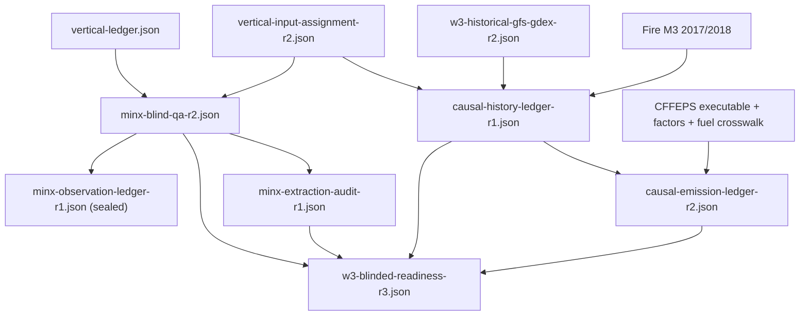

# W3 artifact, schema, and disposition dictionary

**Date:** 2026-07-27  
**Scope:** blinded MINX observation preparation, causal source histories,
causal CFFEPS emissions, and pre-execution readiness  
**Methods:** [full scientific record](progress/2026-07-27-w3-blind-observation-and-causal-emissions.md)  
**Execution:** [reproduction runbook](w3-reproduction-runbook-2026-07-27.md)

> **Scope notice:** This dictionary preserves the immutable original 16-case
> analysis. It has been superseded for candidate availability, but not altered
> retrospectively, by the
> [expanded 2017-current MISR inventory](progress/2026-07-27-w3-expanded-misr-2017-current.md).
> The expanded inventory has 109 observation-qualified candidates and 88
> source/area-qualified candidates across 37 orbits. Its central/reserve
> cohort, meteorology, and causal emissions have not yet been frozen.

## 1. Artifact root and retention classes

The analysis root is:

```text
/Volumes/BigMrStorage/weatherapp_data/weather/derived/smoke/validation/
readiness/cffeps-flexpart-successor-2026-v1/w3-blind-analysis/
```

Artifacts have three retention classes:

| Class | Meaning | Deletion policy |
|---|---|---|
| final | Current input to scientific review | retain immutably |
| sealed | Contains observed height magnitudes | retain immutably; restrict pre-execution access |
| failed/superseded | Documents an identified method or implementation problem | retain immutably as audit trail |

No revision should be renamed to masquerade as another revision. New work gets
a new suffix.

## 2. Revision history

| Artifact | Status | Reason |
|---|---|---|
| `minx-blind-qa-r1.json` | failed, retained | required provider successful retrievals to equal all raw result rows; rejected every case before height extraction |
| `minx-blind-qa-r2.json` | final | corrected the non-height metadata check to `0 < successful <= raw rows` |
| `minx-observation-ledger-r1.json` | sealed final | first and only extraction from the frozen r2 selections |
| `minx-extraction-audit-r1.json` | final safe audit | status/count view of the sealed extraction |
| `causal-history-ledger-r1.json` | final | exact 24-hour pre-overpass source histories |
| `causal-emission-ledger-r1.json` | superseded, retained | varied FFMC/DMC/DC but supplied total pre-overpass area to early CFFEPS hours |
| `causal-emission-ledger-r2.json` | final | adds cumulative area only through each source hour |
| `w3-blinded-readiness-r1.json` | superseded, retained | joined observation and source-history gates before CFFEPS emission completion |
| `w3-blinded-readiness-r2.json` | superseded, retained | joined causal-emission r1 |
| `w3-blinded-readiness-r3.json` | final | joins final causal-emission r2 |

## 3. Final artifact graph



## 4. Complete case disposition

`eligible` means the case passes all four machine gates. It does not mean
independent scientific approval.

| Overpass | Valid selected-band retrievals | Observation | Causal source | Causal CFFEPS | Final |
|---|---:|---|---|---|---|
| `2017-O093614` | 19 | frozen | ready | ready | eligible |
| `2017-O093687` | 10 | frozen | ready | ready | eligible |
| `2017-O093717` | 19 | frozen | ready | ready | eligible |
| `2017-O093745` | 3 | measurement-invalid | ready | ready | excluded |
| `2017-O093819` | 1 | measurement-invalid | ready | ready | excluded |
| `2017-O093877` | 3 | measurement-invalid | no causal central area | excluded upstream | excluded |
| `2017-O093919` | 14 | frozen | ready | ready | eligible |
| `2017-O093978` | 0 | measurement-invalid | ready | ready | excluded |
| `2018-O098477` | 47 | frozen | ready | ready | eligible |
| `2018-O098506` | 4 | measurement-invalid | ready | no hourly causal input | excluded |
| `2018-O098725` | not extracted | prior input-invalid | prior input-invalid | excluded upstream | excluded |
| `2018-O099017` | 0 | measurement-invalid | ready | ready | excluded |
| `2018-O099032` | 0 | measurement-invalid | ready | ready | excluded |
| `2018-O099061` | 4 | measurement-invalid | ready | ready | excluded |
| `2018-O099221` | 2 | measurement-invalid | ready | ready | excluded |
| `2018-O099337` | 104 | frozen | ready | ready | eligible |

Totals:

```text
prospective overpasses       16
height-blind files selected  15
observations frozen           6
causal source histories      14
causal CFFEPS histories      13
all-gate eligible cases       6
formal minimum               10
```

## 5. Height-blind MINX QA ledger

File:

```text
minx-blind-qa-r2.json
```

Identity:

```text
schema_version   1
artifact_type    w3-height-blind-minx-qa-ledger
operator_version misr-minx-height-blind-blue-land-smoke-v1
```

Top-level fields:

| Field | Meaning |
|---|---|
| `analyst_status` | non-independence disclosure state |
| `conflict_disclosure` | earlier header-viewing and role disclosure |
| `method` | permitted fields, categorical QA, geometry, thresholds, and rank |
| `sources` | vertical and assignment ledgers with paths, sizes, and hashes |
| `prospective_overpass_count` | complete frozen candidate count |
| `selected_count` | source-linked files selected without height access |
| `excluded_*_count` | exclusions before height extraction |
| `records` | one record per overpass |
| `selection_firewall` | booleans recording prohibited inputs |

Per-overpass record:

| Field | Meaning |
|---|---|
| `overpass_id` | stable year/orbit identity |
| `event_id` | frozen source-event identity |
| `status` | selection or pre-observation exclusion |
| `reason` | null for selected cases; explicit for exclusions |
| `candidates` | source-linked blue/red candidates and blind checks |
| `selected` | frozen region, band, rank, path, size, and hash |

Permitted statuses:

```text
selected_height_blind
excluded_blind_qa
excluded_pre_observation_input_invalid
```

The blind parser deliberately does not retain or convert MINX height columns.

## 6. Sealed observation ledger and safe extraction audit

Sealed file:

```text
minx-observation-ledger-r1.json
```

Identity:

```text
schema_version   1
artifact_type    vertical-plume-observation-ledger
operator_version misr-minx-blue-wind-corrected-median-agl-v1
```

This file contains observed height samples or summaries and must remain closed
to anyone still choosing the model or observation operator.

Safe audit file:

```text
minx-extraction-audit-r1.json
```

Identity:

```text
schema_version   1
artifact_type    w3-minx-post-selection-extraction-audit
operator_version misr-minx-blue-wind-corrected-median-agl-v1
```

Safe audit fields:

| Field | Meaning |
|---|---|
| `blind_qa_ledger` | exact parent artifact identity |
| `observation_ledger` | sealed child path, size, and hash |
| `frozen_observation_count` | retained overpasses |
| `excluded_post_selection_measurement_invalid_count` | selected files failing the fixed measurement rule |
| `records` | counts and statuses without height magnitudes |
| `holdout_height_values_printed_or_inspected_by_script` | must be false |

Per-record statuses:

```text
observation_frozen
excluded_post_selection_measurement_invalid
not_selected_before_height_extraction
```

## 7. Causal source-history ledger

File:

```text
causal-history-ledger-r1.json
```

Identity:

```text
schema_version   1
artifact_type    w3-causal-source-history-ledger
operator_version w3-pre-overpass-causal-source-history-v1
```

Each ready ledger record points to:

```text
causal-histories-r1/<OVERPASS>/causal-source-history.json
```

Event-history top-level fields:

| Field | Meaning and units |
|---|---|
| `history_start_utc` | exact overpass minus 24 hours |
| `overpass_time_utc` | exact MISR acquisition time |
| `source_latitude`, `source_longitude` | decimal degrees |
| `fuel` | frozen Fire M3 fuel and crosswalk provenance |
| `area_partitions` | area before, inside, and after window, hectares |
| `released_area_totals_ha` | area with an available causal state |
| `area_unreleased_due_to_unavailable_prior_state_ha` | omitted, never shifted |
| `firem3_evidence_count` | complete nearby Fire M3 states in lookback/window |
| `segments` | exact piecewise source history |
| `causality_checks` | machine assertions |
| `sources` | assignment, area, fuel, GFS, and Fire M3 hashes |
| `causality_scope` | physical-event-time versus operational-availability statement |
| `selection_firewall` | prohibited observation/model access flags |

Segment fields:

| Field | Meaning and units |
|---|---|
| `start_utc`, `end_utc` | half-open segment timestamps |
| `duration_seconds` | segment duration |
| `candidate_area_ha` | MCD64A1-uniform area before state availability |
| `released_area_ha` | causal area actually admitted |
| `fire_state` | latest prior Fire M3 state or null |
| `meteorology` | causal GFS surface and 40-level profile |

Fire-state fields:

```text
observed_at_utc
age_seconds_at_segment_start
distance_km
ffmc
dmc
dc
sensor
source
provider_row_sha256
```

Meteorology fields:

| Field | Units |
|---|---|
| `initialization_time_utc` | UTC |
| `valid_time_utc` | UTC |
| `latitude`, `longitude` | degrees |
| `specific_humidity_kg_kg` | kg/kg |
| `wind_speed_knots` | knots |
| `dewpoint_k` | kelvin |
| `elevation_m` | metres |
| `pressure_pa` | pascals, 40 levels |
| `temperature_k` | kelvin, 40 levels |
| `height_m_agl` | metres AGL, 40 levels |
| `manifest_sha256` | source GFS manifest identity |

Source-history statuses:

```text
ready_causal_source_history
excluded_no_causal_central_area
excluded_pre_history_input_invalid
```

## 8. Causal CFFEPS emission ledger

Final file:

```text
causal-emission-ledger-r2.json
```

Identity:

```text
schema_version   1
artifact_type    w3-causal-cffeps-emission-history-ledger
operator_version w3-pre-overpass-causal-cffeps-emissions-v1
```

Each ready record points to:

```text
causal-emissions-r2/<OVERPASS>/emissions.nc
causal-emissions-r2/<OVERPASS>/emissions.manifest.json
causal-emissions-r2/<OVERPASS>/cffeps/
```

The `cffeps/` directory contains exact driver inputs, raw CFFEPS CSV output,
stdout/stderr, and configuration for that event. It is part of the
reproduction evidence.

Ledger record fields:

| Field | Meaning |
|---|---|
| `status` | ready or explicit upstream/hourly exclusion |
| `row_count` | normalized NetCDF row count |
| `mass_kg_by_species` | PM2.5, CO, and BC mass |
| `coverage` | history, represented, and omitted area |
| `all_emissions_end_no_later_than_overpass` | must be true |
| `emission_bundle` | NetCDF path, size, and hash |
| `manifest` | JSON manifest path, size, and hash |
| `manifest_bundle_sha256` | cross-check against manifest's bundle entry |

Emission statuses:

```text
ready_causal_cffeps_emission_history
excluded_no_hourly_causal_emission_input
excluded_by_causal_source_history
```

## 9. NetCDF emission bundle variables

The NetCDF file has one `row` dimension. Each row is one event, time interval,
combustion phase, species, and vertical layer.

String variables:

| Variable | Meaning |
|---|---|
| `run_id` | causal W3 run identity |
| `event_id` | frozen fire identity |
| `fuel_type` | CFFEPS/FBP fuel |
| `combustion_phase` | `flaming`, `smoldering`, or `residual` |
| `species` | `PM25`, `CO`, or `BC` |
| `quality_flags` | operator and clipping annotations |

Time variables:

| Variable | Units |
|---|---|
| `source_time_start` | seconds since 1970-01-01 00:00:00 UTC |
| `source_time_end` | seconds since 1970-01-01 00:00:00 UTC |

Numeric variables:

| Variable | Units/meaning |
|---|---|
| `latitude`, `longitude` | decimal degrees |
| `incremental_area_m2` | square metres |
| `fuel_consumption_kg_m2` | kg dry fuel per square metre |
| `emitted_mass_kg` | kg species in this layer |
| `emission_rate_kg_s` | kg species per second |
| `plume_bottom_m_agl` | metres AGL |
| `plume_top_m_agl` | metres AGL |
| `vertical_layer_bottom_m_agl` | metres AGL |
| `vertical_layer_top_m_agl` | metres AGL |
| `vertical_fraction` | dimensionless fraction |

For each event/time/phase/species group, vertical fractions sum to one within
the verifier tolerance. Mass must be finite and nonnegative.

## 10. Emission manifest fields

Every `emissions.manifest.json` records:

- event and overpass identity;
- exact history, CFFEPS start, overpass, and last-release times;
- causal source-history hash;
- species masses and represented/omitted area;
- CFFEPS executable and driver-input hashes;
- hourly fire-weather-state operator and state-file hash;
- hourly cumulative-area operator and area-file hash;
- emission-factor registry version and hash;
- FBP fuel parameters;
- CFFEPS released/pending fuel balance;
- MCD64A1 area-scaling curve;
- temporal clipping and no-redistribution policy;
- observation/FLEXPART firewall flags; and
- final NetCDF filename, size, and hash.

The final pending CFFEPS phase queue is reported but does not enter the
pre-overpass transport history after the interval ends.

## 11. Final readiness ledger

File:

```text
w3-blinded-readiness-r3.json
```

Identity:

```text
schema_version   1
artifact_type    w3-blinded-preexecution-readiness
operator_version w3-blinded-readiness-status-join-v1
```

Top-level decision fields:

| Field | Final value |
|---|---|
| `prospective_overpass_count` | 16 |
| `eligible_overpass_count` | 6 |
| `minimum_overpasses` | 10 |
| `sample_size_gate_passed` | false |
| `independent_review_gate_passed` | false |
| `formal_execution_permitted` | false |
| `status` | `blocked_insufficient_eligible_observations` |

Per-record gates:

```text
height_blind_file_selection
post_selection_measurement_validity
causal_source_history
causal_cffeps_emission_history
```

The readiness ledger also stores selected-source, causal-history, and
emission-bundle hashes. It does not store observed height magnitudes.

## 12. Final aggregate scientific content

For the 13 final causal CFFEPS bundles:

```text
source-history released central area  8,276.035211 ha
hourly represented area               8,130.326444 ha
conservatively omitted area             145.708767 ha
PM2.5 mass                            7,741,816.321 kg
CO mass                              51,117,833.021 kg
black-carbon mass                       111,273.976 kg
```

For the source-history cohort:

```text
within-window central area            8,473.843675 ha
released with causal state            8,278.211611 ha
withheld without prior state            195.632064 ha
post-overpass daily area excluded    40,498.419591 ha
```

These are exploratory source-model results, not W3 performance metrics.

## 13. Publication and archive checklist

Before submission or public release:

- archive the raw-provider licenses and citations;
- retain all raw and derived SHA-256 values;
- include the methods record, this dictionary, and the runbook;
- include the complete 16-case rejection ledger, not only eligible cases;
- retain failed/superseded revisions with their explanations;
- identify the exact source revision or create a repository snapshot;
- archive the CFFEPS binary, compiler version, flags, and upstream source hash;
- include independent reviewer decisions and conflicts;
- state that final MCD64A1 supports retrospective physical causality, not
  real-time operational availability;
- do not report a W3 FLEXPART score unless the sample and independent-review
  gates pass; and
- never describe the current implementation author as the independent
  observation reviewer.
